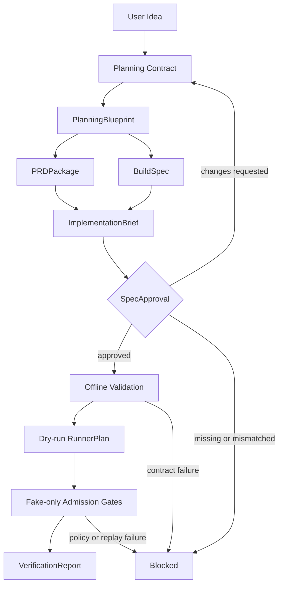

# Agentic Workbench

Agentic Workbench는 아이디어를 명세, 승인, dry-run 실행 계획, 검증 리포트로 연결하는 로컬/개발용 AI agent workflow harness prototype이다.

이 프로젝트의 중심은 앱 생성 결과를 주장하는 것이 아니라, agent workflow가 실행되기 전에 필요한 계약, 승인, 실행 계획, 검증 경계를 명시하는 것이다.

## Problem

LLM에게 앱 구현을 한 번에 맡기면 요구사항 누락, 문서와 코드의 불일치, 실행 전 위험 확인 부족, 검증 누락이 동시에 발생할 수 있다. Agentic Workbench는 이 과정을 artifact pipeline으로 나누고, 승인 전 handoff와 side effect를 통제한다.

## Identity

```text
Agentic Workbench
AI Agent Workflow Harness

Current path:
IdeaBrief
-> PlanningBlueprint
-> PRDPackage / BuildSpec
-> ImplementationBrief
-> SpecApproval
-> offline validation
-> dry-run RunnerPlan
-> fake-only admission gates
-> VerificationReport
```

## Architecture



## Current MVP Scope

Current implementation:

- Shared contracts: `IdeaBrief`, `PlanningBlueprint`, `PRDPackage`, `ImplementationBrief`, `SpecApproval`, `BuildSpec`, `RunnerPlan`, `VerificationReport`
- Planning-state adapter that preserves idea, plan sections, research evidence, visual requirements, and markdown structure
- Build-spec adapter that derives API, frontend, data model, and acceptance criteria contracts
- Human-reviewable `PRDPackage` and execution-oriented `ImplementationBrief`
- `SpecApproval` gate that blocks missing or mismatched approval
- Offline validation for execution-state compatibility
- Side-effect-free dry-run runner that emits `RunnerPlan`
- Fail-closed runner provider registry for offline, dry-run, and gated fake paths
- Fake-only admission gates for future live/provider boundaries
- In-memory repository boundaries for sanitized run and artifact read models
- In-memory repository boundaries for sanitized runner plan, verification report, and audit event read models
- SQLite adapter skeleton for sanitized runner plan, verification report, audit event, and source artifact projection rows
- SQLite adapter skeleton for sanitized approval subject, approval decision, and replay nonce rows
- Separate SQLite adapter skeleton for sanitized canonical run-session and artifact rows
- Public API projection for sanitized fixture responses with fixture/synthetic markers
- Sanitized fake provider/live admission API demo paths that reuse canonical approval persistence
- Explicit SQLite-backed fake admission API wiring for cross-request replay evidence
- Sanitized evidence read-model API for persisted runner/report/audit and approval/replay rows
- Optional fixture evidence write path for `/api/v1/runs` into sanitized local runner/report/audit rows
- Repository-backed run/artifact read APIs for sanitized local projection rows
- Canonical run/artifact read APIs for sanitized local run-session and artifact rows
- Composed canonical run/evidence read API that keeps canonical run state primary and evidence as a sanitized summary
- Local service-shaped demo script over the public API and composed read model
- Minimal Markdown/CLI run status surface over the local demo summary
- Fail-closed live-open policy gate for future Solar Pro 3 / DAACS target runtime work
- Static HTML UI shell over the same sanitized public demo summary
- Disabled-by-default Solar Pro 3 provider adapter skeleton with fake/live path separation
- No-call Solar Pro 3 request/response contract fixtures with cost/timeout policy checks
- Provider envelope persistence/read-model projection for no-call Solar contract evidence
- Provider envelope admission service before disabled Solar adapter invocation
- Provider envelope admission API/read-model hook for local no-call precheck evidence
- Test-only DIV/DAACS source identity fixtures for parity reference
- Fixture-based source identity smoke path from planning artifact to dry-run report
- Source-to-target trace and portfolio-safe claim projection for parity evidence
- Sanitizers for secrets, PII-like values, unsafe paths, raw payload fields, and public artifact exposure
- Local unit/smoke/eval documentation for regression tracking

Not included in the current scope:

- Real external provider calls
- Direct original runtime execution
- Generated application artifact production
- CLI agent execution
- Package install, server start, unrestricted file write
- Hosted deployment success claim
- Production security, trust, or durable persistence claim
- Hosted or production database persistence claim
- Source UI shell migration

## Project Structure

```text
apps/api/agentic_workbench_api/   FastAPI entrypoint sketch
packages/core/                    shared schemas, artifacts, events, safety gates
packages/                         planning adapters, build boundaries, runner gates
packages/harness/                 workflow orchestration
examples/                         fixture inputs/outputs
tests/                            unit, smoke, and integration test folders
docs/                             public architecture, migration, metrics, eval notes
```

## Verification

Run the local test suite:

```powershell
python -m pytest tests
```

Latest documented local baseline:

```text
Measurement date: 2026-06-01
Pytest: 397 / 397 passed
Live LLM calls in offline/dry-run/fake paths: 0
Live API calls in offline/dry-run/fake paths: 0
Provider calls/imports in the latest documented eval: 0
Network calls in the latest documented eval: 0
Direct original-runtime calls in the latest documented eval: 0
```

These numbers describe local regression and boundary checks. They are not production, hosting, model-quality, or security-certification claims.

## Claim Boundary

Allowed public summary:

- Local/dev AI agent workflow harness prototype
- Contract-based artifact pipeline from idea to planning package, build spec, approval, dry-run plan, and verification report
- Approval gate before execution handoff
- Side-effect-free dry-run plan generation
- Fake-only admission gates with external calls kept at 0 in current paths
- Optional SQLite-backed replay wiring for fake admission gates
- Canonical approval persistence service before durable replay claim
- Sanitized fake admission API demo paths for provider/live approval persistence
- SQLite-backed fake admission API mode selected only through server-side config
- Sanitized evidence read-model API for local repository projections
- Optional fixture evidence persistence for local repository projections
- Repository-backed run/artifact read APIs for local projection rows
- SQLite-backed canonical run/artifact read APIs for local projection rows
- Composed canonical run/evidence read models for local projection rows
- Local fixture/dry-run service-shaped demo over the public API boundary
- Minimal local Markdown/CLI run status surface over fixture/dry-run projections
- Live-open readiness policy gate that keeps provider/runtime calls at 0 and does not grant execution permission
- Static local UI shell over sanitized fixture/dry-run projections
- Disabled Solar Pro 3 provider adapter skeleton with provider calls kept at 0
- No-call Solar Pro 3 request/response contract fixtures with sanitized summary/hash projection
- Sanitized provider envelope read model for no-call contract hashes, counts, and status
- Local no-call provider envelope admission service before disabled Solar adapter invocation
- Local no-call provider envelope admission API/read-model hook with status/hash/count projection
- Public output designed around sanitized summaries and correlation hashes

Do not interpret current results as:

- Real external-provider integration success
- Direct original runtime execution success
- Generated application production
- Hosted deployment success
- Production security or durable replay infrastructure
- Benchmark, success-rate, or productivity proof
- Solar Pro 3 model-quality or response-quality proof
- Provider envelope read model as provider outcome, hosted observability, or production provider readiness
- Provider envelope admission service as provider execution, model-quality proof, hosted provider service, or production provider readiness
- Provider envelope admission API hook as external provider behavior, hosted provider service, or production provider readiness

## Status

Current status: contract/gate/dry-run/fake-boundary MVP with sanitized public API fixture projection, source identity golden path smoke coverage, claim-safe trace projection, hash/count repository boundaries, SQLite adapter skeletons for runner/report/audit evidence, approval/replay evidence, canonical run/artifact rows, and provider envelope evidence, canonical approval persistence service wiring before replay claim, sanitized fake admission API demo paths, explicit SQLite-backed fake admission API wiring, sanitized evidence read-model API skeleton, optional fixture evidence persistence, canonical run/artifact read APIs, composed canonical run/evidence read API, local service-shaped demo script, minimal Markdown/CLI run status surface, static HTML UI shell, disabled Solar Pro 3 provider adapter skeleton, no-call Solar Pro 3 contract fixtures, provider envelope read-model projection, provider envelope admission service, and provider envelope admission API/read-model hook for local no-call evidence.

Current status also includes a fail-closed live-open policy gate. A passing policy decision can only mark a future surface as eligible for a separate implementation unit; it does not grant execution permission.

Next implementation track: provider precheck policy UX and explicit operator approval envelope, still without external calls.
