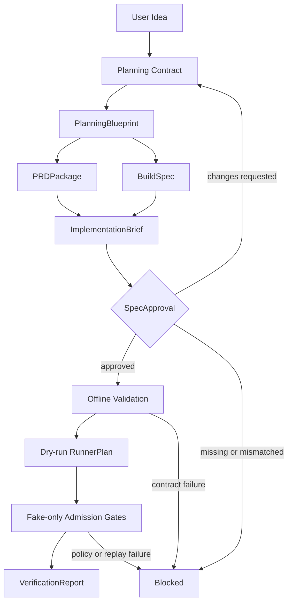

# Agentic Workbench

Agentic Workbench는 아이디어를 명세, 승인, dry-run 실행 계획, 검증 리포트로 연결하는 로컬/개발용 AI agent workflow harness prototype이다.

이 프로젝트의 중심은 앱 생성 결과를 주장하는 것이 아니라, agent workflow가 실행되기 전에 필요한 계약, 승인, 실행 계획, 검증 경계를 명시하는 것이다.

## Problem

LLM에게 앱 구현을 한 번에 맡기면 요구사항 누락, 문서와 코드의 불일치, 실행 전 위험 확인 부족, 검증 누락이 동시에 발생할 수 있다. Agentic Workbench는 이 과정을 artifact pipeline으로 나누고, 승인 전 handoff와 side effect를 통제한다.

## Identity

```text
Agentic Workbench
AI Agent Workflow Harness

Current path:
IdeaBrief
-> PlanningBlueprint
-> PRDPackage / BuildSpec
-> ImplementationBrief
-> SpecApproval
-> offline validation
-> dry-run RunnerPlan
-> fake-only admission gates
-> VerificationReport
```

## Architecture



## Current MVP Scope

Current implementation:

- Shared contracts: `IdeaBrief`, `PlanningBlueprint`, `PRDPackage`, `ImplementationBrief`, `SpecApproval`, `BuildSpec`, `RunnerPlan`, `VerificationReport`
- Planning-state adapter that preserves idea, plan sections, research evidence, visual requirements, and markdown structure
- Build-spec adapter that derives API, frontend, data model, and acceptance criteria contracts
- Human-reviewable `PRDPackage` and execution-oriented `ImplementationBrief`
- `SpecApproval` gate that blocks missing or mismatched approval
- Offline validation for execution-state compatibility
- Side-effect-free dry-run runner that emits `RunnerPlan`
- Fail-closed runner provider registry for offline, dry-run, and gated fake paths
- Fake-only admission gates for future live/provider boundaries
- In-memory repository boundaries for sanitized run and artifact read models
- In-memory repository boundaries for sanitized runner plan, verification report, and audit event read models
- SQLite adapter skeleton for sanitized runner plan, verification report, audit event, and source artifact projection rows
- SQLite adapter skeleton for sanitized approval subject, approval decision, and replay nonce rows
- Separate SQLite adapter skeleton for sanitized canonical run-session and artifact rows
- Public API projection for sanitized fixture responses with fixture/synthetic markers
- Sanitized fake provider/live admission API demo paths that reuse canonical approval persistence
- Explicit SQLite-backed fake admission API wiring for cross-request replay evidence
- Sanitized evidence read-model API for persisted runner/report/audit and approval/replay rows
- Optional fixture evidence write path for `/api/v1/runs` into sanitized local runner/report/audit rows
- Repository-backed run/artifact read APIs for sanitized local projection rows
- Canonical run/artifact read APIs for sanitized local run-session and artifact rows
- Composed canonical run/evidence read API that keeps canonical run state primary and evidence as a sanitized summary
- Local service-shaped demo script over the public API and composed read model
- Minimal Markdown/CLI run status surface over the local demo summary
- Fail-closed live-open policy gate for future Solar Pro 3 / DAACS target runtime work
- Static HTML UI shell over the same sanitized public demo summary
- AW-MVP-01 service-shaped vertical slice with 7/7 stage coverage and a verification read-model endpoint
- Disabled Solar planner provider preflight boundary for fixture-vs-preflight comparison, still no provider call
- Controlled Solar planner one-shot spike preparation with hash-only envelope and mocked response projection, still no provider call
- Operator-opted Solar planner one-shot live spike evidence with provider/network/env-read counts capped at 1 and public output limited to hash/status/count projection
- Solar planner quality comparison over public live-spike projection with reviewer-gated draft binding and zero additional provider calls by default
- Reviewer-gated Solar draft PlanningBlueprint/PRDPackage projection over quality evidence, with canonical artifact writes and additional live calls kept at 0
- DAACS target runtime sandbox preflight boundary for dry-run-vs-preflight comparison, still no runtime call
- Disabled generated artifact bundle contract over the persisted output manifest read model, still no runtime call or generated file body
- Fixture-backed target runtime artifact materialization in a configured run-scoped workspace, returning relative paths, hashes, status, and counts only
- Portfolio-facing artifact preview surface over the same public summary, showing workflow coverage, document chain status, sanitized fixture artifact cards, verification status, and zero-call counters
- Restricted fixture app skeleton generation under a run-scoped workspace, returning generated file relative paths, hashes, byte counts, status, and zero-call counters only
- Document-linked DAACS runtime MVP fixture codegen that binds PlanningBlueprint, PRDPackage, ImplementationBrief, and optional Solar draft projection hashes into a `codegen_input_hash`, then writes a richer generated app fixture under the same run-scoped workspace
- Generated fixture app skeleton verification by workspace-relative path, content hash, and byte count, returning hash/status/count projection only
- Build-ready candidate manifest for the generated fixture app, returning script labels, dependency labels, source marker counts, hashes, status, and zero-call counters only
- Explicit opt-in local fixture app package/build attempt in a run-scoped workspace, returning command labels, exit-code hashes, output hashes, byte counts, durations, status, and counts only
- One-command local portfolio demo package that writes a sanitized JSON summary and static HTML preview over the same public projection
- Disabled-by-default Solar Pro 3 provider adapter skeleton with fake/live path separation
- No-call Solar Pro 3 request/response contract fixtures with cost/timeout policy checks
- Provider envelope persistence/read-model projection for no-call Solar contract evidence
- Provider envelope admission service before disabled Solar adapter invocation
- Provider envelope admission API/read-model hook for local no-call precheck evidence
- Operator approval envelope for provider precheck policy summary hash binding
- Live provider dry-admission checklist and manual runbook projection
- Manual provider test proposal gate that remains disabled by default
- Disabled manual provider test executor boundary
- Blocked manual provider test review packet for policy/preflight/readiness hashes
- Hash-only manual provider test review packet export/read-model
- Final no-call manual provider test handoff packet over policy/preflight/readiness/review/export hashes
- First live-call operator opt-in checklist bound to the handoff packet hash, still execution-closed
- Sealed pre-execution packet over handoff, opt-in, cost/timeout/quota, and rollback/abort hashes
- No-call live execution arming record over sealed packet, operator, expiry, rollback, and abort hashes
- No-call execution authorization release proposal over arming record, operator, release window, and rollback hashes
- No-call final release packet over release proposal, arming record, operator, release window, and rollback hashes
- Disabled first-call execution switch over final release packet and switch-enable hashes
- Disabled first-call executor preflight over execution switch, final release packet, and no-call counter hashes
- Disabled first-call executor dispatch record over executor preflight, planned dispatch, and no-call counter hashes
- Disabled first-call invocation receipt over dispatch record, result placeholder, and no-call counter hashes
- Disabled first-call post-invocation audit over invocation receipt, claim-boundary, and no-call counter hashes
- Disabled first-call completion summary over post-invocation audit, claim-boundary, and no-call counter hashes
- Disabled first-call closeout record over completion summary, claim-boundary, and no-call counter hashes
- Disabled first-call operator handback over closeout, operator-review, claim-boundary, and no-call counter hashes
- Disabled first-call operator decision packet over handback, operator-decision, claim-boundary, and no-call counter hashes
- Disabled first-call operator release attestation over decision packet, operator-attestation, claim-boundary, and no-call counter hashes
- Disabled first-call release authorization seal over release-attestation, seal-material, claim-boundary, and no-call counter hashes
- Disabled first-call execution authorization capsule over release seal, final authorization, claim-boundary, and no-call counter hashes
- Disabled first-call execution capsule export/read-model over execution capsule, export metadata, claim-boundary, and no-call counter hashes
- Disabled first-call execution capsule handoff packet over export, export read-model, claim-boundary, and no-call counter hashes
- Disabled first-call execution capsule operator review over handoff packet, operator-review, claim-boundary, and no-call counter hashes
- Disabled first-call execution capsule operator decision over operator review, operator-decision, claim-boundary, and no-call counter hashes
- Disabled first-call execution capsule release attestation over operator decision, release-attestation, claim-boundary, and no-call counter hashes
- Disabled first-call execution capsule release seal over release-attestation, seal-material, claim-boundary, and no-call counter hashes
- Disabled first-call execution capsule final authorization over release seal, final authorization, claim-boundary, and no-call counter hashes
- Disabled first-call execution capsule authorization export/read-model over final authz, export metadata, claim-boundary, and no-call counter hashes
- Disabled first-call execution capsule authorization handoff packet over authz export, authz read-model, claim-boundary, and no-call counter hashes
- Disabled first-call execution capsule authorization operator review over authz handoff packet, operator-review, claim-boundary, and no-call counter hashes
- Disabled first-call execution capsule authorization operator decision over authz operator-review, operator-decision, claim-boundary, and no-call counter hashes
- Disabled first-call execution capsule authorization release attestation over authz operator-decision, release-attestation, claim-boundary, and no-call counter hashes
- Disabled first-call execution capsule authorization release seal over authz release-attestation, seal-material, claim-boundary, and no-call counter hashes
- Disabled first-call execution capsule authorization final authorization over authz release seal, final-authorization, claim-boundary, and no-call counter hashes
- Disabled first-call execution capsule authorization final authorization export/read-model over authz final authorization, export metadata, claim-boundary, and no-call counter hashes
- Disabled first-call execution capsule authorization final authorization handoff packet over authz final authorization export, export read-model, claim-boundary, and no-call counter hashes
- Disabled first-call execution capsule authorization final authorization operator review over authz final authorization handoff packet, operator-review, claim-boundary, and no-call counter hashes
- Disabled first-call execution capsule authorization final authorization operator decision over authz final authorization operator-review, operator-decision, claim-boundary, and no-call counter hashes
- Disabled first-call execution capsule authorization final authorization release attestation over authz final authorization operator-decision, release-attestation, claim-boundary, and no-call counter hashes
- Disabled first-call execution capsule authorization final authorization release seal over authz final authorization release-attestation, seal-material, claim-boundary, and no-call counter hashes
- Disabled first-call execution capsule authorization final authorization final authorization over authz final authorization release seal, final-authorization, claim-boundary, and no-call counter hashes
- Disabled first-call execution capsule authorization final authorization final authorization export/read-model over authz final authorization final authorization, export metadata, claim-boundary, and no-call counter hashes
- Disabled first-call execution capsule authorization final authorization final authorization handoff packet over authz final authorization final authorization export, export read-model, claim-boundary, and no-call counter hashes
- Disabled first-call execution capsule authorization final authorization final authorization operator review over authz final authorization final authorization handoff packet, operator-review, claim-boundary, and no-call counter hashes
- Disabled first-call execution capsule authorization final authorization final authorization operator decision over authz final authorization final authorization operator-review, operator-decision, claim-boundary, and no-call counter hashes
- Disabled first-call execution capsule authorization final authorization final authorization release attestation over authz final authorization final authorization operator-decision, release-attestation, claim-boundary, and no-call counter hashes
- Disabled first-call execution capsule authorization final authorization final authorization release seal over authz final authorization final authorization release-attestation, seal-material, claim-boundary, and no-call counter hashes
- Disabled first-call execution capsule authorization final authorization final authorization final authorization over authz final authorization final authorization release seal, final-authorization, claim-boundary, and no-call counter hashes
- Disabled first-call execution capsule authorization final authorization final authorization final authorization export/read-model over authz final authorization final authorization final authorization, export metadata, claim-boundary, and no-call counter hashes
- Disabled first-call execution capsule authorization final authorization final authorization final authorization handoff packet over authz final authorization final authorization final authorization export, export read-model, claim-boundary, and no-call counter hashes
- Disabled first-call execution capsule authorization final authorization final authorization final authorization operator review over authz final authorization final authorization final authorization handoff packet, operator-review, claim-boundary, and no-call counter hashes
- Disabled first-call execution capsule authorization final authorization final authorization final authorization operator decision over authz final authorization final authorization final authorization operator-review, operator-decision, claim-boundary, and no-call counter hashes
- Disabled first-call execution capsule authorization final authorization final authorization final authorization release attestation over authz final authorization final authorization final authorization operator-decision, release-attestation, claim-boundary, and no-call counter hashes
- Disabled first-call execution capsule authorization final authorization final authorization final authorization release seal over authz final authorization final authorization final authorization release-attestation, seal-material, claim-boundary, and no-call counter hashes
- Disabled first-call execution capsule authorization final authorization final authorization final authorization final authorization over authz final authorization final authorization final authorization release seal, final-authorization, claim-boundary, and no-call counter hashes
- Test-only DIV/DAACS source identity fixtures for parity reference
- Fixture-based source identity smoke path from planning artifact to dry-run report
- Source-to-target trace and portfolio-safe claim projection for parity evidence
- Sanitizers for secrets, PII-like values, unsafe paths, raw payload fields, and public artifact exposure
- Local unit/smoke/eval documentation for regression tracking

Not included in the current scope:

- Real external provider calls
- Direct original runtime execution
- Generated application artifact production, except disabled bundle contracts, sanitized local fixture artifacts, document-linked restricted fixture app files, hash-only verification of those fixture files, static validation of the generated fixture workspace, build-ready candidate manifest projection, and explicit opt-in local fixture app package/build attempt evidence
- Deployed app preview or package/build verification beyond the local fixture
  attempt evidence
- CLI agent execution
- Server start, unrestricted file write, and package install/build outside the explicit run-scoped local fixture app build attempt path
- Hosted deployment success claim
- Production security, trust, or durable persistence claim
- Hosted or production database persistence claim
- Source UI shell migration

## Project Structure

```text
apps/api/agentic_workbench_api/   FastAPI entrypoint sketch
packages/core/                    shared schemas, artifacts, events, safety gates
packages/                         planning adapters, build boundaries, runner gates
packages/harness/                 workflow orchestration
examples/                         fixture inputs/outputs
tests/                            unit, smoke, and integration test folders
docs/                             public architecture, migration, metrics, eval notes
```

## Verification

Run the local test suite:

```powershell
python -m pytest tests
```

## Portfolio Demo

Run the local portfolio package:

```powershell
python examples\demo-service-flow\run_portfolio_demo.py --output-dir .local\aw-demo-final-01 --allow-local-build-attempt
```

This writes:

```text
aw-demo-final-01-summary.json
aw-demo-final-01-preview.html
```

The command produces local fixture/demo evidence only. It may run one local
fixture app package/build attempt when `--allow-local-build-attempt` is present,
but it does not start a server, call an external provider, execute the DAACS
target runtime, or claim hosted behavior.

Latest documented local baseline:

```text
Measurement date: 2026-06-05
Pytest: 713 / 713 passed
Live LLM calls in offline/dry-run/fake paths: 0
Live API calls in offline/dry-run/fake paths: 0
Provider calls/imports in the latest documented eval: 0
Provider/runtime network calls in the latest documented eval: 0
Direct original-runtime calls in the latest documented eval: 0
```

These numbers describe local regression and boundary checks. They are not production, hosting, model-quality, or security-certification claims.

## Claim Boundary

Allowed public summary:

- Local/dev AI agent workflow harness prototype
- Contract-based artifact pipeline from idea to planning package, build spec, approval, dry-run plan, and verification report
- Approval gate before execution handoff
- Side-effect-free dry-run plan generation
- Fake-only admission gates with external calls kept at 0 in current paths
- Optional SQLite-backed replay wiring for fake admission gates
- Canonical approval persistence service before durable replay claim
- Sanitized fake admission API demo paths for provider/live approval persistence
- SQLite-backed fake admission API mode selected only through server-side config
- Sanitized evidence read-model API for local repository projections
- Optional fixture evidence persistence for local repository projections
- Repository-backed run/artifact read APIs for local projection rows
- SQLite-backed canonical run/artifact read APIs for local projection rows
- Composed canonical run/evidence read models for local projection rows
- Local fixture/dry-run service-shaped demo over the public API boundary
- Minimal local Markdown/CLI run status surface over fixture/dry-run projections
- Local restricted fixture app skeleton, hash verification, static validation,
  build-ready candidate manifest, and explicit opt-in local fixture app
  package/build attempt with server/provider/runtime calls kept at `0`
- Live-open readiness policy gate that keeps provider/runtime calls at 0 and does not grant execution permission
- Static local UI shell over sanitized fixture/dry-run projections
- Disabled Solar Pro 3 provider adapter skeleton with provider calls kept at 0
- No-call Solar Pro 3 request/response contract fixtures with sanitized summary/hash projection
- Sanitized provider envelope read model for no-call contract hashes, counts, and status
- Local no-call provider envelope admission service before disabled Solar adapter invocation
- Local no-call provider envelope admission API/read-model hook with status/hash/count projection
- Local no-call operator approval envelope for provider precheck policy summaries
- Local dry-admission checklist and manual runbook for future provider test proposals
- Local manual provider test proposal gate with execution disabled by default
- Disabled local executor boundary for manual provider test proposals
- Blocked local review packet for manual provider test policy, preflight, and readiness hashes
- Hash-only local review packet export/read-model for manual provider test evidence
- Final no-call local handoff packet for manual provider test evidence
- Local no-call operator opt-in checklist bound to the handoff packet hash
- Local no-call sealed pre-execution packet over pre-call hashes and counts
- Local no-call arming record over sealed packet, operator, expiry, rollback, and abort hashes
- Local no-call release proposal over arming record, operator, release window, and rollback hashes
- Local no-call final release packet over release proposal, arming record, operator, release window, and rollback hashes
- Local disabled execution switch over final release packet and switch-enable hashes
- Local disabled executor preflight over execution switch and no-call counter hashes
- Local disabled executor dispatch record over executor preflight and planned dispatch hashes
- Local disabled invocation receipt over dispatch record and result-placeholder hashes
- Local disabled post-invocation audit over invocation receipt, claim-boundary, and no-call counter hashes
- Local disabled completion summary over post-invocation audit, claim-boundary, and no-call counter hashes
- Local disabled closeout record over completion summary, claim-boundary, and no-call counter hashes
- Local disabled operator handback over closeout, operator-review, claim-boundary, and no-call counter hashes
- Local disabled operator decision packet over handback, operator-decision, claim-boundary, and no-call counter hashes
- Local disabled operator release attestation over decision packet, operator-attestation, claim-boundary, and no-call counter hashes
- Local disabled release authorization seal over release-attestation, seal-material, claim-boundary, and no-call counter hashes
- Local disabled execution authorization capsule over release seal, final authorization, claim-boundary, and no-call counter hashes
- Local disabled execution capsule export/read-model over execution capsule, export metadata, claim-boundary, and no-call counter hashes
- Local disabled execution capsule handoff packet over export, export read-model, claim-boundary, and no-call counter hashes
- Local disabled execution capsule operator review over handoff packet, operator-review, claim-boundary, and no-call counter hashes
- Local disabled execution capsule operator decision over operator review, operator-decision, claim-boundary, and no-call counter hashes
- Local disabled execution capsule release attestation over operator decision, release-attestation, claim-boundary, and no-call counter hashes
- Local disabled execution capsule release seal over release-attestation, seal-material, claim-boundary, and no-call counter hashes
- Local disabled execution capsule final authorization over release seal, final authorization, claim-boundary, and no-call counter hashes
- Local disabled execution capsule authorization export/read-model over final authz, export metadata, claim-boundary, and no-call counter hashes
- Local disabled execution capsule authorization handoff packet over authz export, authz read-model, claim-boundary, and no-call counter hashes
- Local disabled execution capsule authorization operator review over authz handoff packet, operator-review, claim-boundary, and no-call counter hashes
- Local disabled execution capsule authorization operator decision over authz operator-review, operator-decision, claim-boundary, and no-call counter hashes
- Local disabled execution capsule authorization release attestation over authz operator-decision, release-attestation, claim-boundary, and no-call counter hashes
- Local disabled execution capsule authorization release seal over authz release-attestation, seal-material, claim-boundary, and no-call counter hashes
- Local disabled execution capsule authorization final authorization over authz release seal, final-authorization, claim-boundary, and no-call counter hashes
- Local disabled execution capsule authorization final authorization export/read-model over authz final authorization, export metadata, claim-boundary, and no-call counter hashes
- Local disabled execution capsule authorization final authorization handoff packet over authz final authorization export, export read-model, claim-boundary, and no-call counter hashes
- Local disabled execution capsule authorization final authorization operator review over authz final authorization handoff packet, operator-review, claim-boundary, and no-call counter hashes
- Local disabled execution capsule authorization final authorization operator decision over authz final authorization operator-review, operator-decision, claim-boundary, and no-call counter hashes
- Local disabled execution capsule authorization final authorization release attestation over authz final authorization operator-decision, release-attestation, claim-boundary, and no-call counter hashes
- Local disabled execution capsule authorization final authorization release seal over authz final authorization release-attestation, seal-material, claim-boundary, and no-call counter hashes
- Local disabled execution capsule authorization final authorization final authorization over authz final authorization release seal, final-authorization, claim-boundary, and no-call counter hashes
- Local disabled execution capsule authorization final authorization final authorization export/read-model over authz final authorization final authorization, export metadata, claim-boundary, and no-call counter hashes
- Local disabled execution capsule authorization final authorization final authorization handoff packet over authz final authorization final authorization export, export read-model, claim-boundary, and no-call counter hashes
- Local disabled execution capsule authorization final authorization final authorization operator review over authz final authorization final authorization handoff packet, operator-review, claim-boundary, and no-call counter hashes
- Local disabled execution capsule authorization final authorization final authorization operator decision over authz final authorization final authorization operator-review, operator-decision, claim-boundary, and no-call counter hashes
- Local disabled execution capsule authorization final authorization final authorization release attestation over authz final authorization final authorization operator-decision, release-attestation, claim-boundary, and no-call counter hashes
- Local disabled execution capsule authorization final authorization final authorization release seal over authz final authorization final authorization release-attestation, seal-material, claim-boundary, and no-call counter hashes
- Local disabled execution capsule authorization final authorization final authorization final authorization over authz final authorization final authorization release seal, final-authorization, claim-boundary, and no-call counter hashes
- Local disabled execution capsule authorization final authorization final authorization final authorization export/read-model over authz final authorization final authorization final authorization, export metadata, claim-boundary, and no-call counter hashes
- Local disabled execution capsule authorization final authorization final authorization final authorization handoff packet over authz final authorization final authorization final authorization export, export read-model, claim-boundary, and no-call counter hashes
- Local disabled execution capsule authorization final authorization final authorization final authorization operator review over authz final authorization final authorization final authorization handoff packet, operator-review, claim-boundary, and no-call counter hashes
- Local disabled execution capsule authorization final authorization final authorization final authorization operator decision over authz final authorization final authorization final authorization operator-review, operator-decision, claim-boundary, and no-call counter hashes
- Local disabled execution capsule authorization final authorization final authorization final authorization release attestation over authz final authorization final authorization final authorization operator-decision, release-attestation, claim-boundary, and no-call counter hashes
- Local disabled execution capsule authorization final authorization final authorization final authorization release seal over authz final authorization final authorization final authorization release-attestation, seal-material, claim-boundary, and no-call counter hashes
- Local disabled execution capsule authorization final authorization final authorization final authorization final authorization over authz final authorization final authorization final authorization release seal, final-authorization, claim-boundary, and no-call counter hashes
- Local disabled execution capsule authorization final authorization final authorization final authorization final authorization export/read-model over authz final authorization final authorization final authorization final authorization, export metadata, claim-boundary, and no-call counter hashes
- Public output designed around sanitized summaries and correlation hashes

Do not interpret current results as:

- Real external-provider integration success beyond one bounded Solar planner
  spike
- Direct original runtime execution success
- Generated application production
- Build-ready candidate manifest as package install success, build success,
  server start, hosted behavior, or generated app production
- Local build preflight as package install success, build success, server start,
  hosted behavior, or generated app production
- Hosted deployment success
- Production security or durable replay infrastructure
- Benchmark, success-rate, or productivity proof
- Solar Pro 3 model-quality or response-quality proof
- Provider envelope read model as provider outcome, hosted observability, or production provider readiness
- Provider envelope admission service as provider execution, model-quality proof, hosted provider service, or production provider readiness
- Provider envelope admission API hook as external provider behavior, hosted provider service, or production provider readiness
- Operator approval envelope as production operator identity, provider execution permission, or external provider outcome
- Dry-admission checklist as live permission, provider behavior evidence, hosted approval authority, or production provider readiness
- Manual provider test proposal gate as provider execution permission, provider behavior evidence, hosted approval authority, or production provider readiness
- Disabled manual provider test executor boundary as provider execution, provider behavior evidence, hosted execution, or production provider readiness
- One-shot permission contract as provider execution permission, provider behavior evidence, hosted execution, or production provider readiness
- Preflight audit bundle as provider execution permission, provider behavior evidence, hosted execution, or production provider readiness
- Readiness decision record as provider execution permission, provider behavior evidence, hosted execution, or production provider readiness
- Review packet as provider execution permission, provider behavior evidence, hosted execution, or production provider readiness
- Review packet export/read-model as provider execution permission, provider behavior evidence, hosted execution, or production provider readiness
- Handoff packet as provider execution permission, provider behavior evidence, hosted execution, or production provider readiness
- Operator opt-in checklist as provider execution permission, provider behavior evidence, hosted execution, or production provider readiness
- Sealed pre-execution packet as provider execution permission, provider behavior evidence, hosted execution, or production provider readiness
- Arming record as provider execution permission, provider behavior evidence, hosted execution, or production provider readiness
- Release proposal as provider execution permission, provider behavior evidence, hosted execution, or production provider readiness
- Final release packet as provider execution permission, provider behavior evidence, hosted execution, or production provider readiness
- Execution switch as provider execution permission, provider behavior evidence, hosted execution, or production provider readiness
- Post-invocation audit as provider execution permission, provider behavior evidence, hosted execution, or production provider readiness
- Completion summary as provider execution permission, provider behavior evidence, hosted execution, or production provider readiness
- Closeout record as provider execution permission, provider behavior evidence, hosted execution, or production provider readiness
- Operator handback as provider execution permission, provider behavior evidence, live operator approval, hosted execution, or production provider readiness
- Operator decision packet as provider execution permission, provider behavior evidence, live operator approval, hosted execution, or production provider readiness
- Operator release attestation as provider execution permission, provider behavior evidence, live operator approval, hosted execution, or production provider readiness
- Release authorization seal as provider execution permission, provider behavior evidence, live operator approval, hosted execution, or production provider readiness
- Execution authorization capsule as provider execution permission, provider behavior evidence, live operator approval, hosted execution, or production provider readiness
- Execution capsule export/read-model as provider execution permission, provider behavior evidence, live operator approval, hosted execution, or production provider readiness
- Execution capsule handoff packet as provider execution permission, provider behavior evidence, live operator approval, hosted execution, or production provider readiness
- Execution capsule operator review as provider execution permission, provider behavior evidence, live operator approval, hosted execution, or production provider readiness
- Execution capsule operator decision as provider execution permission, provider behavior evidence, live operator approval, hosted execution, or production provider readiness
- Execution capsule release attestation as provider execution permission, provider behavior evidence, live operator approval, hosted execution, or production provider readiness
- Execution capsule release seal as provider execution permission, provider behavior evidence, live operator approval, hosted execution, or production provider readiness
- Execution capsule authorization export/read-model as provider execution permission, provider behavior evidence, live operator approval, hosted execution, or production provider readiness
- Execution capsule authorization handoff packet as provider execution permission, provider behavior evidence, live operator approval, hosted execution, or production provider readiness
- Execution capsule authorization operator review as provider execution permission, provider behavior evidence, live operator approval, hosted execution, or production provider readiness
- Execution capsule authorization operator decision as provider execution permission, provider behavior evidence, live operator approval, hosted execution, or production provider readiness
- Execution capsule authorization release attestation as provider execution permission, provider behavior evidence, live operator approval, hosted execution, or production provider readiness
- Execution capsule authorization release seal as provider execution permission, provider behavior evidence, live operator approval, hosted execution, or production provider readiness
- Execution capsule authorization final authorization as provider execution permission, provider behavior evidence, live operator approval, hosted execution, or production provider readiness
- Execution capsule authorization final authorization export/read-model as provider execution permission, provider behavior evidence, live operator approval, hosted execution, or production provider readiness
- Execution capsule authorization final authorization handoff packet as provider execution permission, provider behavior evidence, live operator approval, hosted execution, or production provider readiness
- Execution capsule authorization final authorization operator review as provider execution permission, provider behavior evidence, live operator approval, hosted execution, or production provider readiness
- Execution capsule authorization final authorization operator decision as provider execution permission, provider behavior evidence, live operator approval, hosted execution, or production provider readiness
- Execution capsule authorization final authorization release attestation as provider execution permission, provider behavior evidence, live operator approval, hosted execution, or production provider readiness
- Execution capsule authorization final authorization release seal as provider execution permission, provider behavior evidence, live operator approval, hosted execution, or production provider readiness
- Execution capsule authorization final authorization final authorization as provider execution permission, provider behavior evidence, live operator approval, hosted execution, or production provider readiness
- Execution capsule authorization final authorization final authorization export/read-model as provider execution permission, provider behavior evidence, live operator approval, hosted execution, or production provider readiness
- Execution capsule authorization final authorization final authorization handoff packet as provider execution permission, provider behavior evidence, live operator approval, hosted execution, or production provider readiness
- Execution capsule authorization final authorization final authorization operator review as provider execution permission, provider behavior evidence, live operator approval, hosted execution, or production provider readiness
- Execution capsule authorization final authorization final authorization operator decision as provider execution permission, provider behavior evidence, live operator approval, hosted execution, or production provider readiness
- Execution capsule authorization final authorization final authorization release attestation as provider execution permission, provider behavior evidence, live operator approval, hosted execution, or production provider readiness
- Execution capsule authorization final authorization final authorization release seal as provider execution permission, provider behavior evidence, live operator approval, hosted execution, or production provider readiness
- Execution capsule authorization final authorization final authorization final authorization as provider execution permission, provider behavior evidence, live operator approval, hosted execution, or production provider readiness
- Execution capsule authorization final authorization final authorization final authorization export/read-model as provider execution permission, provider behavior evidence, live operator approval, hosted execution, or production provider readiness
- Execution capsule authorization final authorization final authorization final authorization handoff packet as provider execution permission, provider behavior evidence, live operator approval, hosted execution, or production provider readiness
- Execution capsule authorization final authorization final authorization final authorization operator review as provider execution permission, provider behavior evidence, live operator approval, hosted execution, or production provider readiness
- Execution capsule authorization final authorization final authorization final authorization operator decision as provider execution permission, provider behavior evidence, live operator approval, hosted execution, or production provider readiness
- Execution capsule authorization final authorization final authorization final authorization release attestation as provider execution permission, provider behavior evidence, live operator approval, hosted execution, or production provider readiness
- Execution capsule authorization final authorization final authorization final authorization release seal as provider execution permission, provider behavior evidence, live operator approval, hosted execution, or production provider readiness
- Execution capsule authorization final authorization final authorization final authorization final authorization as provider execution permission, provider behavior evidence, live operator approval, hosted execution, or production provider readiness
- Execution capsule authorization final authorization final authorization final authorization final authorization export/read-model as provider execution permission, provider behavior evidence, live operator approval, hosted execution, or production provider readiness

## Status

Current status: contract/gate/dry-run/fake-boundary MVP with sanitized public API fixture projection, source identity golden path smoke coverage, claim-safe trace projection, hash/count repository boundaries, SQLite adapter skeletons for runner/report/audit evidence, approval/replay evidence, canonical run/artifact rows, and provider envelope evidence, canonical approval persistence service wiring before replay claim, sanitized fake admission API demo paths, explicit SQLite-backed fake admission API wiring, sanitized evidence read-model API skeleton, optional fixture evidence persistence, canonical run/artifact read APIs, composed canonical run/evidence read API, local service-shaped demo script, minimal Markdown/CLI run status surface, static HTML UI shell, disabled Solar Pro 3 provider adapter skeleton, no-call Solar Pro 3 contract fixtures, provider envelope read-model projection, provider envelope admission service, provider envelope admission API/read-model hook, operator approval envelope for local no-call provider precheck evidence, dry-admission checklist/runbook projection, manual provider test proposal gate, disabled manual provider test executor boundary, blocked one-shot permission contract projection, blocked manual provider test preflight audit bundle, blocked readiness decision record, blocked manual provider test review packet, hash-only review packet export/read-model, final no-call handoff packet, first live-call operator opt-in checklist boundary, sealed pre-execution packet boundary, no-call live execution arming record, no-call execution authorization release proposal, no-call final release packet, disabled first-call execution switch, disabled first-call executor preflight, disabled first-call executor dispatch record, disabled first-call invocation receipt, disabled first-call post-invocation audit, disabled first-call completion summary, disabled first-call closeout record, disabled first-call operator handback, disabled first-call operator decision packet, disabled first-call operator release attestation, disabled first-call release authorization seal, disabled first-call execution authorization capsule, disabled first-call execution capsule export/read-model, disabled first-call execution capsule handoff packet, disabled first-call execution capsule operator review, disabled first-call execution capsule operator decision, disabled first-call execution capsule release attestation, disabled first-call execution capsule release seal, disabled first-call execution capsule final authorization, disabled first-call execution capsule authorization export/read-model, disabled first-call execution capsule authorization handoff packet, disabled first-call execution capsule authorization operator review, disabled first-call execution capsule authorization operator decision, disabled first-call execution capsule authorization release attestation, disabled first-call execution capsule authorization release seal, disabled first-call execution capsule authorization final authorization, disabled first-call execution capsule authorization final authorization export/read-model, disabled first-call execution capsule authorization final authorization handoff packet, disabled first-call execution capsule authorization final authorization operator review, disabled first-call execution capsule authorization final authorization operator decision, disabled first-call execution capsule authorization final authorization release attestation, disabled first-call execution capsule authorization final authorization release seal, disabled first-call execution capsule authorization final authorization final authorization, disabled first-call execution capsule authorization final authorization final authorization export/read-model, disabled first-call execution capsule authorization final authorization final authorization handoff packet, disabled first-call execution capsule authorization final authorization final authorization operator review, disabled first-call execution capsule authorization final authorization final authorization operator decision, disabled first-call execution capsule authorization final authorization final authorization release attestation, disabled first-call execution capsule authorization final authorization final authorization release seal, disabled first-call execution capsule authorization final authorization final authorization final authorization, disabled first-call execution capsule authorization final authorization final authorization final authorization export/read-model, disabled first-call execution capsule authorization final authorization final authorization final authorization handoff packet, disabled first-call execution capsule authorization final authorization final authorization final authorization operator review, disabled first-call execution capsule authorization final authorization final authorization final authorization operator decision, disabled first-call execution capsule authorization final authorization final authorization final authorization release attestation, and disabled first-call execution capsule authorization final authorization final authorization final authorization release seal.

Current status also includes a fail-closed live-open policy gate. A passing policy decision can only mark a future surface as eligible for a separate implementation unit; it does not grant execution permission.

Current status addendum: AW-LIVE-67 adds the disabled first-call execution capsule authorization final authorization final authorization final authorization final authorization boundary over release-seal, final-authorization, claim-boundary, and no-call counter hashes while keeping execution permission closed.

Current status addendum: AW-LIVE-68 adds the disabled first-call execution capsule authorization final authorization final authorization final authorization final authorization export/read-model boundary over final-authorization, export metadata, claim-boundary, and no-call counter hashes while keeping execution permission closed.

Current status addendum: AW-LIVE-69 adds the disabled first-call execution capsule authorization final authorization final authorization final authorization final authorization handoff packet boundary over export/read-model, claim-boundary, and no-call counter hashes while keeping execution permission closed.

Current status addendum: AW-LIVE-CHAIN-01 consolidates repeated local no-call boundary evaluation into a private helper for AW-LIVE-67 and AW-LIVE-68 while keeping public field names unchanged and execution permission closed.

Current status addendum: AW-LIVE-CHAIN-02 extends the no-call boundary helper to AW-LIVE-60 through AW-LIVE-66. The consolidated helper now covers AW-LIVE-60 through AW-LIVE-68 while preserving public field names and execution permission `0`.

Current status addendum: AW-LIVE-CHAIN-03 extends the no-call boundary helper to AW-LIVE-53 through AW-LIVE-59. The consolidated helper now covers AW-LIVE-53 through AW-LIVE-68 while preserving public field names and execution permission `0`.

Current status addendum: AW-MVP-01 adds a service-shaped local vertical slice over the same public API and read models. The representative path covers Idea, PlanningBlueprint, PRDPackage, ImplementationBrief, Approval, RunnerPlan, and VerificationReport, adds `GET /api/v1/runs/{run_id}/verification`, and keeps provider and target runtime call counts at `0`. AW-SOLAR-01 adds a disabled Solar planner provider preflight comparison path; the artifact-producing planner remains fixture-based. AW-DAACS-RUNTIME-00 adds a DAACS target runtime sandbox preflight comparison path over the RunnerPlan hash; target runtime execution remains closed. AW-DAACS-RUNTIME-01 adds a disabled DAACS target runtime adapter admission skeleton bound to the preflight hash; valid preflight evidence can reach the disabled adapter, but execution permission remains `0`.

Current status addendum: AW-LIVE-CHAIN-04 extends the no-call boundary helper to AW-LIVE-46 through AW-LIVE-52. The consolidated helper now covers AW-LIVE-46 through AW-LIVE-69 while preserving public field names and execution permission `0`.

Current status addendum: AW-DAACS-RUNTIME-02 adds persisted disabled DAACS target runtime adapter admission evidence and a public read model. The SQLite row stores only hash/status/count fields, the read-model returns hash/status/count and repository boundary flags only, and execution permission remains `0`.

Current status addendum: AW-DAACS-RUNTIME-03 adds a disabled target runtime output manifest contract over the persisted adapter admission read model. The manifest exposes output group labels, hashes, counts, and zero-call boundaries only. It does not write generated files or run DAACS target runtime code.

Current status addendum: AW-DAACS-RUNTIME-04 persists the disabled output manifest as a hash/status/count-only SQLite evidence row and exposes a public read model by run_id. The read model returns manifest hashes, status, reason, counts, repository flags, and zero-call counters only.

Current status addendum: AW-DAACS-RUNTIME-05 defines a disabled generated artifact bundle contract over the persisted output manifest read model. The bundle projection returns artifact unit labels, hashes, counts, status, reason, and zero-call boundaries only. It does not write generated file bodies or run DAACS target runtime code.

Current status addendum: AW-DAACS-RUNTIME-06 materializes sanitized fixture artifacts under a configured run-scoped local workspace. The public projection returns relative paths, hashes, status, reason, counts, repository flags, and claim boundary only. It does not expose file bodies or local root paths, and target runtime calls remain `0`.

Current status addendum: AW-VERIFY-01 verifies the restricted fixture app skeleton files by workspace-relative path, content hash, and byte count. The public projection returns verification hashes, status, reasons, counts, repository flags, and zero-call counters only. It reads local fixture files for hashing but does not expose file bodies, local root paths, provider payloads, or runtime output.

Current status addendum: AW-BUILD-01 statically validates the verified fixture app workspace. It checks package JSON parsing, required script labels, App/API markers, and zero-call notes while keeping package install, build, server start, provider calls, network calls, subprocess calls, and DAACS target runtime calls at `0`.

Current status addendum: AW-BUILD-02 hardens the generated fixture app manifest into a build-ready candidate projection. It checks script labels, dependency labels, `index.html`, `src/main.tsx`, `vite.config.ts`, and `tsconfig.json` markers while keeping package install, build, server start, provider calls, network calls, subprocess calls, and DAACS target runtime calls at `0`.

Current status addendum: AW-BUILD-03 adds local build preflight over the build-ready candidate manifest. It exposes command labels, command hashes, opt-in requirement, and zero default execution counters while keeping package install, build, server start, provider calls, network calls, subprocess calls, and DAACS target runtime calls at `0`.

Current status addendum: AW-BUILD-04 adds one explicit opt-in local fixture app package/build attempt inside a run-scoped generated workspace. The measured local path records two sanitized command outcomes, package install count `1`, build count `1`, server start count `0`, provider call count `0`, and DAACS target runtime call count `0`.

Current status addendum: AW-DEMO-FINAL-01 packages the local service-shaped demo into one reviewer-facing command that writes a sanitized JSON summary and static HTML preview. With explicit local build opt-in, the measured path records stage coverage `7/7`, generated fixture app files `9`, package install attempts `1`, build attempts `1`, server starts `0`, provider calls `0`, and DAACS target runtime calls `0`.

Current status addendum: AW-SOLAR-LIVE-01 adds one operator-opted Solar planner live spike over the service-shaped demo. The measured path records provider calls `1`, network calls `1`, env value reads `1`, response status code `200`, response projection count `1`, server starts `0`, and DAACS target runtime calls `0`; the default planner remains fixture-based and public output remains hash/status/count only.

Current status addendum: AW-SOLAR-QUALITY-01 compares fixture planner evidence with Solar live-spike public projection using section count, artifact hint count, missing required stage count, and reviewer approval hash status. The default comparison performs `0` additional provider calls and keeps Solar-authored artifact binding blocked unless reviewer approval is present.

Next implementation track: bind reviewer-approved Solar quality evidence into draft PlanningBlueprint/PRDPackage generation, or move to DAACS runtime MVP if generated-code realism is the higher portfolio gap.
