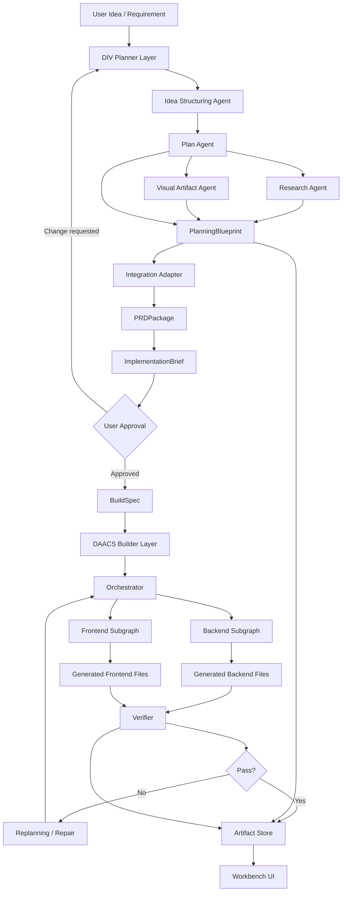

# Agentic Workbench

기획, 리서치, 코드 생성, 검증을 하나의 실행 루프로 연결한 AI Agent Workflow Harness.

Agentic Workbench는 자연어 아이디어를 `PlanningBlueprint`, `PRDPackage`, `ImplementationBrief`, `BuildSpec`, DAACS 실행 결과, 검증 리포트로 연결하는 로컬/개발용 프로토타입이다. 기존 `DIV`는 기획/리서치 레이어로, `DAACS`는 코드 생성/검증 레이어로 재사용한다.

## Problem

LLM에게 "앱을 만들어 달라"고 한 번에 요청하면 요구사항 누락, 근거 부족, 코드와 문서의 불일치, 검증 부재가 동시에 발생한다. 이 프로젝트는 agent가 일하는 절차, 상태, 산출물, 검증 루프를 명시적으로 관리하는 harness를 만든다.

## Identity

```text
Agentic Workbench
AI Agent Workflow Harness
Idea -> Plan -> Research -> BuildSpec -> Code -> VerificationReport
Current contract path: Idea -> PlanningBlueprint -> PRDPackage -> ImplementationBrief -> Approval -> BuildSpec -> DAACS boundary -> RunnerPlan -> fake live gate -> fake provider boundary -> signed approval / nonce replay gate -> verifier / replay store boundary
```

## Architecture



## Current MVP Scope

포함:

- 공통 schema: `IdeaBrief`, `PlanningBlueprint`, `PRDPackage`, `ImplementationBrief`, `SpecApproval`, `BuildSpec`, `VerificationReport`
- DIV-style state를 `PlanningBlueprint`로 바꾸는 adapter
- DIV `GlobalState`의 `idea.blueprint`, `plan.sections`, `research`, `visual_artifacts` 의미 보존 adapter
- `PlanningBlueprint`를 DAACS-style `BuildSpec`으로 바꾸는 adapter
- `PlanningBlueprint`와 `BuildSpec`를 사람 검토용 `PRDPackage`로 바꾸는 adapter
- `PRDPackage`와 `BuildSpec`를 DAACS handoff용 `ImplementationBrief`로 바꾸는 adapter
- 승인 전 builder 호출을 차단하는 사용자 승인 gate
- feature-based `BuildSpec` endpoint/model/frontend/acceptance criteria 생성
- `BuildSpec`를 DAACS-compatible initial state로 변환하는 offline adapter
- DAACS-compatible state를 실행 없이 검증하는 offline runner boundary
- offline / dry-run / live runner provider boundary 설계
- `RunnerProvider` skeleton과 fail-closed registry
- 승인된 `ImplementationBrief`에서 side-effect 0 `RunnerPlan`을 생성하는 dry-run runner
- 승인된 `RunnerPlan`과 `ApprovalRecord`를 검증한 뒤 fake runtime만 호출하는 gated live runner skeleton
- Solar Pro 3용 provider contract와 fake provider boundary. 실제 `.env` 값은 읽지 않고 env key 이름만 참조
- provider/live approval의 구조적 `signed_contract_hash`, `signature_id`, `nonce` 검증과 in-memory replay guard
- approval verifier interface와 export/import 기반 `PersistentReplayStore` restart simulation skeleton
- fixture 기반 harness smoke test
- secret redaction, evidence sanitization, claim boundary gate
- path boundary, public artifact exposure gate
- 정량 baseline 문서화

제외:

- live LLM/API 호출
- `.env` secret value 읽기 또는 공개 evidence 기록
- production 배포
- 사용자 인증/협업 기능
- benchmark/eval harness 완성 주장
- DIV Streamlit UI 그대로 통합
- DAACS/DIV 전체 코드 복사 병합

## Quantitative Baseline

| Source | Core code files | Notes | Reuse candidates | Test files |
|---|---:|---|---:|---:|
| DAACS | 108 | Python 30 + TS/TSX 78. UI primitive 47개를 제외하면 실질 앱 로직 약 61개 | 14 | 0 |
| DIV | 43 | `src/` 아래 Python 실행 로직 중심 | 15 | 0 |

해석: 재사용 후보는 많지만, 두 원본 모두 실제 테스트 파일이 확인되지 않았다. 그래서 통합의 첫 기준은 기능 확장보다 schema, adapter, redaction, claim boundary, smoke test다.

## Project Structure

```text
apps/api/agentic_workbench_api/   FastAPI entrypoint sketch
packages/core/                    shared schemas, artifacts, events, safety gates
packages/div_planner/             DIV output adapter boundary
packages/daacs_builder/           DAACS input/output adapter boundary
packages/harness/                 workflow orchestration
examples/                         fixture inputs/outputs
tests/                            unit and smoke tests
docs/                             architecture, migration, claim boundary, retrospectives
```

## Verification

```powershell
python -m pytest tests
```

현재 `AW-NEXT-01` 기준 검증 결과:

```text
AW-NEXT-01: 30 passed
AW-NEXT-02: 36 passed
AW-NEXT-03: 45 passed
AW-NEXT-04: 67 passed
AW-NEXT-05: docs-only runner provider boundary design
AW-NEXT-06: 74 passed
AW-NEXT-07A: 83 passed
AW-NEXT-07B: 94 passed
AW-NEXT-08: 121 passed
AW-NEXT-09: 148 passed
AW-NEXT-10: 162 passed
AW-NEXT-11: 172 passed
live LLM/API calls: 0
```

검증 우선순위:

```text
formatter -> lint -> typecheck -> unit test -> integration test -> smoke test -> build
```

## Claim Boundary

사용 가능:

- LangGraph 기반 AI Agent Workflow Harness
- 로컬/개발 환경용 workflow prototype
- 기획, 리서치, 코드 생성, 검증을 연결한 artifact pipeline
- fixture 기반 smoke test 통과
- PRD/ImplementationBrief 승인 gate가 DAACS 진입 전 builder 호출을 차단함
- 승인된 ImplementationBrief 기반 dry-run RunnerPlan 생성, side-effect counter 0
- 승인된 RunnerPlan과 ApprovalRecord 기반 fake live admission gate 통과, side-effect counter 0
- Solar Pro 3 provider boundary skeleton에서 `UPSTAGE_API_KEY` key name만 참조, fake provider metrics 기록
- provider/live approval skeleton에서 unsigned, tampered signed payload, reused nonce를 차단함
- verifier 미주입, verifier 오류, replay store 오류를 blocked result로 차단함

금지:

- 완전 자동 개발 보장
- 운영 배포 성공
- 보안 검증 완료
- 코드 생성 성공률 보장
- 생산성 향상 수치 주장
- Solar Pro 3 live 호출 성공
- Upstage API key 로드 성공
- Solar Pro 3 응답 품질 또는 실제 provider 응답 성공
- production cryptographic approval signature 구현 완료
- production-grade persistent nonce/replay store 구현 완료
- production approval verifier 구현 완료
- DAACS live 실행 성공
- real DAACS live runner 구현 완료
- fake live 결과를 실제 DAACS 실행 또는 코드 생성 성공으로 표현
- dry-run 결과를 실제 DAACS 실행 또는 코드 생성 성공으로 표현

## Status

현재 단계는 통합 코드 전체 이식이 아니라, 두 프로젝트를 안전하게 연결하기 위한 `schema + adapter + artifact + approval + runner/provider gate` MVP다. `live` provider는 등록되어 있지만 실제 DAACS/Solar 실행이 아니라 fake runtime admission 검증만 수행한다. Solar Pro 3 boundary도 실제 API 호출이 아니라 fake provider contract 검증이다. AW-NEXT-11의 verifier/replay store는 skeleton이며, 실제 운영 서명 검증과 disk/DB-backed replay persistence는 아직 구현하지 않았다.
