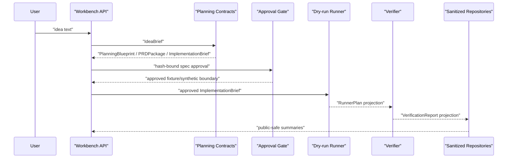

# Architecture

## Conclusion

`Agentic Workbench` is an Idea-to-App agent workflow harness. The current
implementation connects planning contracts, approval gates, dry-run runner
plans, verification reports, sanitized public projections, and persistence
boundaries. Current behavior is local/dev and fixture/dry-run/fake-boundary
only; target runtime execution remains closed.

## Current Layers

```text
API / Harness
  WorkflowSession, public projection, artifact registry, workflow events

Planning Contracts
  IdeaBrief, PlanningBlueprint, PRDPackage, BuildSpec, ImplementationBrief

Approval Boundary
  SpecApproval, approval/replay contracts, provider/live admission skeletons

Runner Boundary
  offline runner, dry-run RunnerPlan, gated fake live/provider paths

Verification Boundary
  VerificationReport with sanitized checks, counts, hashes, and metrics

Persistence Boundary
  sanitized in-memory repositories, file-backed replay fixture,
  SQLite skeletons for runner/report/audit and approval/replay projection rows
```

## Current Flow



## Core Contracts

| Contract | Current purpose |
|---|---|
| `IdeaBrief` | normalize user intent without persisting raw prompt as public evidence |
| `PlanningBlueprint` | preserve planning, evidence, section, and visual intent |
| `PRDPackage` | bundle PRD, feature requirements, API requirements, and acceptance criteria |
| `ImplementationBrief` | handoff summary linked to `BuildSpec` by hash |
| `SpecApproval` | user approval or requested changes for a specific spec/brief hash |
| `RunnerPlan` | side-effect-free dry-run execution plan projection |
| `VerificationReport` | sanitized check/error/file/metric projection |
| repository records | hash/count/linkage rows that exclude raw prompt, raw body, logs, and provider payloads |

## Persistence Boundary

The repository layer stores projection rows only. It may store identifiers,
hashes, counts, safe labels, timestamps, and sanitized summaries. It must not
store raw planned actions, raw logs, raw file bodies, provider/runtime payloads,
approval authorization material, secrets, or raw prompts.

The SQLite adapters are skeletons for local projection persistence. The
runner/report/audit store is separate from the approval/replay store so
execution evidence and admission evidence do not share one implicit trust
boundary. These adapters are not a production database layer, trust root,
hosted service, or external runtime result.

`AW-PERSIST-06` adds an explicit approval/replay repository factory and optional
SQLite-backed replay wiring for fake admission gates. This keeps the default
public API separate from DB selection while allowing provider/live fake
boundaries to fail closed against the same approval/replay store contract. The
SQLite replay path expects canonical approval rows to be stored first; fake
admission does not synthesize durable approval rows.

## Target-Only Runtime

Future work may connect live provider calls and runtime execution after explicit
approval, replay protection, verifier policy, and durable persistence are
complete. Those surfaces are intentionally outside the current executable path.

## Risk Controls

- planning/research gaps are represented as missing evidence, not workflow
  success claims.
- public artifacts expose sanitized summaries and hashes, not raw content.
- fixture/synthetic approval is separate from durable user approval.
- runner/provider/live paths are blocked unless their specific gates pass.
- repository rows are checked for forbidden public keys and unsupported claims.
- SQLite writes use constraints and transactions for sanitized projection rows.
- SQLite approval/replay rows keep immutable subject/decision hashes and
  replay nonce hashes only; raw authorization material is rejected.
- fake admission wiring may choose SQLite replay storage, but external calls
  and target runtime calls remain at 0 in current paths.
