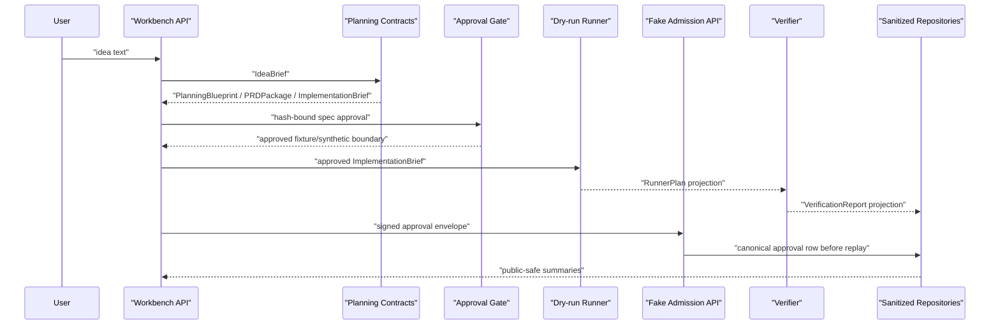

# Architecture

## Conclusion

`Agentic Workbench` is an Idea-to-App agent workflow harness. The current
implementation connects planning contracts, approval gates, dry-run runner
plans, verification reports, sanitized public projections, and persistence
boundaries. Current behavior is local/dev and fixture/dry-run/fake-boundary
only; target runtime execution remains closed.

## Current Layers

```text
API / Harness
  WorkflowSession, public projection, artifact registry, workflow events

Planning Contracts
  IdeaBrief, PlanningBlueprint, PRDPackage, BuildSpec, ImplementationBrief

Approval Boundary
  SpecApproval, approval/replay contracts, provider/live admission skeletons

Runner Boundary
  offline runner, dry-run RunnerPlan, gated fake live/provider paths

Verification Boundary
  VerificationReport with sanitized checks, counts, hashes, and metrics

Persistence Boundary
  sanitized in-memory repositories, file-backed replay fixture,
  SQLite skeletons for runner/report/audit, approval/replay, and canonical
  run/artifact projection rows
```

## Current Flow



## Core Contracts

| Contract | Current purpose |
|---|---|
| `IdeaBrief` | normalize user intent without persisting raw prompt as public evidence |
| `PlanningBlueprint` | preserve planning, evidence, section, and visual intent |
| `PRDPackage` | bundle PRD, feature requirements, API requirements, and acceptance criteria |
| `ImplementationBrief` | handoff summary linked to `BuildSpec` by hash |
| `SpecApproval` | user approval or requested changes for a specific spec/brief hash |
| `RunnerPlan` | side-effect-free dry-run execution plan projection |
| `VerificationReport` | sanitized check/error/file/metric projection |
| repository records | hash/count/linkage rows that exclude raw prompt, raw body, logs, and provider payloads |

## Persistence Boundary

The repository layer stores projection rows only. It may store identifiers,
hashes, counts, safe labels, timestamps, and sanitized summaries. It must not
store raw planned actions, raw logs, raw file bodies, provider/runtime payloads,
approval authorization material, secrets, or raw prompts.

The SQLite adapters are skeletons for local projection persistence. The
runner/report/audit store is separate from the approval/replay store so
execution evidence and admission evidence do not share one implicit trust
boundary. These adapters are not a production database layer, trust root,
hosted service, or external runtime result.

`AW-PERSIST-06` adds an explicit approval/replay repository factory and optional
SQLite-backed replay wiring for fake admission gates. `AW-PERSIST-07` adds a
canonical approval persistence service so provider/live admission can store the
approved subject snapshot and decision row before replay claim. This keeps the
default public API separate from DB selection while allowing future API/demo
paths to reuse the same approval persistence and replay contract. The service
stores canonical hash-bound rows only; fake admission still does not store raw
authorization material or call external provider/runtime surfaces.

`AW-API-01` adds sanitized fake admission API demo paths for provider and live
runner approval envelopes. These endpoints prove API/service wiring can call
`CanonicalApprovalPersistenceService` before replay claim and then return a
public projection with raw authorization fields removed. `AW-API-02` adds a
server-side repository selector so fake admission endpoints can explicitly use
SQLite approval/replay repositories across API requests. The existing fixture
run endpoint remains synthetic and separate from the durable approval demo path,
and does not create the admission SQLite store.

`AW-API-03` adds a read-only evidence API over the same sanitized projection
rows. `GET /api/v1/evidence/runs/{run_id}` returns runner plan, verification
report, audit event, approval, and replay projection rows as hashes, counts,
safe summaries, and linkage fields only. It does not expose raw repository rows,
local database paths, raw authorization material, provider payloads, logs, or
file bodies.

`AW-API-04` adds an optional write path from `/api/v1/runs` fixture output to
the configured local runner/report/audit evidence repository. The API persists a
fixture-derived dry-run runner plan projection, a verification report
projection, audit event projections, and artifact linkage rows only when
`EvidenceRepositoryConfig` is set. The fixture path remains synthetic and does
not write durable approval/replay rows.

`AW-API-05` adds repository-backed run and artifact read APIs over the same
local runner/report/audit evidence store. `GET /api/v1/runs/{run_id}` returns a
summary synthesized from projection rows, and
`GET /api/v1/runs/{run_id}/artifacts` returns artifact metadata rows. These
paths are evidence-backed skeletons, not canonical run-session APIs. They do
not query approval/replay repositories and do not return artifact payload
bodies.

`AW-PERSIST-08` adds a separate SQLite adapter skeleton for canonical
`RunSessionRecord` and `ArtifactRecord` rows. `/api/v1/runs` can persist the
sanitized run-session row and artifact metadata when a `RunArtifactRepository`
is explicitly configured. `GET /api/v1/runs/{run_id}` and
`GET /api/v1/runs/{run_id}/artifacts` now read from this canonical run/artifact
store. These paths do not query runner/report/audit evidence, approval/replay
evidence, external providers, or target runtimes.

## Target-Only Runtime

Future work may connect live provider calls and runtime execution after explicit
approval, replay protection, verifier policy, and durable persistence are
complete. Those surfaces are intentionally outside the current executable path.

## Risk Controls

- planning/research gaps are represented as missing evidence, not workflow
  success claims.
- public artifacts expose sanitized summaries and hashes, not raw content.
- fixture/synthetic approval is separate from durable user approval.
- runner/provider/live paths are blocked unless their specific gates pass.
- repository rows are checked for forbidden public keys and unsupported claims.
- SQLite writes use constraints and transactions for sanitized projection rows.
- SQLite approval/replay rows keep immutable subject/decision hashes and
  replay nonce hashes only; raw authorization material is rejected.
- fake admission wiring may choose SQLite replay storage through the canonical
  approval persistence service, but external calls and target runtime calls
  remain at 0 in current paths.
- API fake admission responses expose only hashes, counts, safe checks, and
  zero-call metrics; raw signature, nonce, and signed contract fields stay out
  of public output.
- API fake admission may report the selected repository backend and persistence
  marker, but never returns local database root paths.
- evidence read-model API paths are read-only and keep provider/runtime calls at
  0.
- fixture evidence persistence writes local projection rows only when explicitly
  configured, and corrupted stores are reported as blocked without raw/path
  echo.
- canonical run/artifact read APIs expose stored run-session and artifact
  metadata projection rows only, keep evidence/admission rows out of the
  response, and keep provider/runtime calls at 0.
