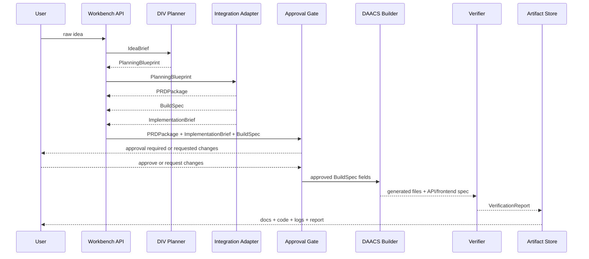

# Architecture

## Conclusion

`Agentic Workbench`는 `DIV -> PRDPackage -> ImplementationBrief -> Approval -> DAACS` 순서의 계층형 통합이다. 두 프로젝트를 같은 폴더에 복사하는 것이 아니라, 기획 산출물을 사람이 승인할 수 있는 명세와 DAACS가 읽을 handoff 계약으로 변환하는 harness를 만든다.

## Layers

```text
UI Layer
  Nova-Canvas 기반 Plan / Evidence / Code / Logs / Report 패널

API Layer
  workflow session, artifact, run event endpoint

Harness Layer
  WorkflowSession, ArtifactRegistry, WorkflowEvent, PRD/brief approval gate, retry policy

Planning Layer
  DIV idea / plan / research / visual graph 추출

Build Layer
  DAACS orchestrator / backend subgraph / frontend subgraph

Verification Layer
  static checks, compatibility checks, verification report
```

## Data Flow



## Core Contracts

| Contract | Purpose |
|---|---|
| `IdeaBrief` | 사용자 자연어 요구를 최소 구조로 정규화 |
| `PlanningBlueprint` | DIV 계층의 문서/근거/기능 산출물 |
| `PRDPackage` | 사용자가 검토할 PRD, 기능 요구사항, API 요구사항, 검수 기준 묶음 |
| `ImplementationBrief` | DAACS handoff용 BuildSpec hash, 작업 요약, 제약, task manifest |
| `SpecApproval` | 특정 implementation brief/build spec hash에 대한 사용자 승인 또는 수정 요청 |
| `BuildSpec` | DAACS 계층이 실행할 API/frontend/backend 계약 |
| `VerificationReport` | 생성 파일, check 결과, 오류, 정량 metric 기록 |

## Adapter Principle

`Integration Adapter`는 이 프로젝트의 핵심이다. adapter가 없으면 두 프로젝트는 단순 병합이고, adapter가 있으면 하나의 AI Agent Workflow Harness가 된다.

입력:

```text
PlanningBlueprint(title, problem, features, evidence, visual_artifacts)
```

출력:

```text
PRDPackage(prd_markdown, feature_requirements, api_requirements, acceptance_criteria)
ImplementationBrief(build_spec_hash, daacs_tasks, constraints, approval_required)
BuildSpec(goal, api_spec, frontend_spec, constraints, acceptance_criteria)
```

## Risk Controls

- 리서치 실패는 전체 workflow 실패가 아니라 evidence 없음 상태로 격리한다.
- 로그와 artifact는 `redact_secrets`를 통과한다.
- public artifact에는 raw search content가 아니라 길이 제한 snippet만 저장한다.
- README와 발표 문구는 claim boundary gate를 통과해야 한다.
- 승인 전에는 builder/provider/DAACS runner를 호출하지 않는다.
- `SpecApproval`은 PRD/brief 승인이고, `ApprovalRecord`는 live runner 실행 승인이다. 두 계약은 혼용하지 않는다.
