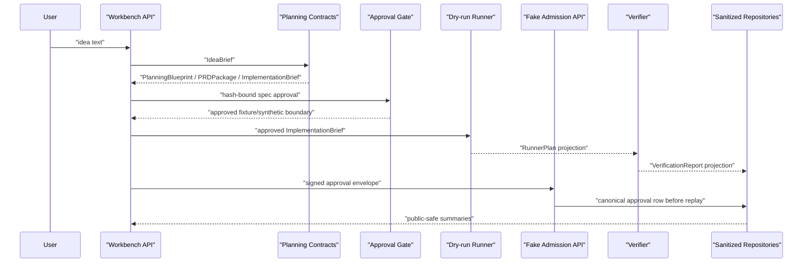

# Architecture

## Conclusion

`Agentic Workbench` is an Idea-to-App agent workflow harness. The current
implementation connects planning contracts, approval gates, dry-run runner
plans, verification reports, sanitized public projections, and persistence
boundaries. Current behavior is local/dev and fixture/dry-run/fake-boundary
only; target runtime execution remains closed.

## Current Layers

```text
API / Harness
  WorkflowSession, public projection, artifact registry, workflow events

Planning Contracts
  IdeaBrief, PlanningBlueprint, PRDPackage, BuildSpec, ImplementationBrief

Approval Boundary
  SpecApproval, approval/replay contracts, provider/live admission skeletons

Runner Boundary
  offline runner, dry-run RunnerPlan, gated fake live/provider paths

Verification Boundary
  VerificationReport with sanitized checks, counts, hashes, and metrics

Persistence Boundary
  sanitized in-memory repositories, file-backed replay fixture,
  SQLite skeletons for runner/report/audit, approval/replay, and canonical
  run/artifact projection rows, plus provider envelope evidence rows
```

## Current Flow



## Core Contracts

| Contract | Current purpose |
|---|---|
| `IdeaBrief` | normalize user intent without persisting raw prompt as public evidence |
| `PlanningBlueprint` | preserve planning, evidence, section, and visual intent |
| `PRDPackage` | bundle PRD, feature requirements, API requirements, and acceptance criteria |
| `ImplementationBrief` | handoff summary linked to `BuildSpec` by hash |
| `SpecApproval` | user approval or requested changes for a specific spec/brief hash |
| `RunnerPlan` | side-effect-free dry-run execution plan projection |
| `VerificationReport` | sanitized check/error/file/metric projection |
| repository records | hash/count/linkage rows that exclude raw prompt, raw body, logs, and provider payloads |
| `ProviderEnvelopeRecord` | no-call provider envelope evidence with contract hashes, counts, and status |

## Persistence Boundary

The repository layer stores projection rows only. It may store identifiers,
hashes, counts, safe labels, timestamps, and sanitized summaries. It must not
store raw planned actions, raw logs, raw file bodies, provider/runtime payloads,
approval authorization material, secrets, or raw prompts.

The SQLite adapters are skeletons for local projection persistence. The
runner/report/audit store is separate from the approval/replay store so
execution evidence and admission evidence do not share one implicit trust
boundary. These adapters are not a production database layer, trust root,
hosted service, or external runtime result.

`AW-PERSIST-06` adds an explicit approval/replay repository factory and optional
SQLite-backed replay wiring for fake admission gates. `AW-PERSIST-07` adds a
canonical approval persistence service so provider/live admission can store the
approved subject snapshot and decision row before replay claim. This keeps the
default public API separate from DB selection while allowing future API/demo
paths to reuse the same approval persistence and replay contract. The service
stores canonical hash-bound rows only; fake admission still does not store raw
authorization material or call external provider/runtime surfaces.

`AW-API-01` adds sanitized fake admission API demo paths for provider and live
runner approval envelopes. These endpoints prove API/service wiring can call
`CanonicalApprovalPersistenceService` before replay claim and then return a
public projection with raw authorization fields removed. `AW-API-02` adds a
server-side repository selector so fake admission endpoints can explicitly use
SQLite approval/replay repositories across API requests. The existing fixture
run endpoint remains synthetic and separate from the durable approval demo path,
and does not create the admission SQLite store.

`AW-API-03` adds a read-only evidence API over the same sanitized projection
rows. `GET /api/v1/evidence/runs/{run_id}` returns runner plan, verification
report, audit event, approval, and replay projection rows as hashes, counts,
safe summaries, and linkage fields only. It does not expose raw repository rows,
local database paths, raw authorization material, provider payloads, logs, or
file bodies.

`AW-API-04` adds an optional write path from `/api/v1/runs` fixture output to
the configured local runner/report/audit evidence repository. The API persists a
fixture-derived dry-run runner plan projection, a verification report
projection, audit event projections, and artifact linkage rows only when
`EvidenceRepositoryConfig` is set. The fixture path remains synthetic and does
not write durable approval/replay rows.

`AW-API-05` adds repository-backed run and artifact read APIs over the same
local runner/report/audit evidence store. `GET /api/v1/runs/{run_id}` returns a
summary synthesized from projection rows, and
`GET /api/v1/runs/{run_id}/artifacts` returns artifact metadata rows. These
paths are evidence-backed skeletons, not canonical run-session APIs. They do
not query approval/replay repositories and do not return artifact payload
bodies.

`AW-PERSIST-08` adds a separate SQLite adapter skeleton for canonical
`RunSessionRecord` and `ArtifactRecord` rows. `/api/v1/runs` can persist the
sanitized run-session row and artifact metadata when a `RunArtifactRepository`
is explicitly configured. `GET /api/v1/runs/{run_id}` and
`GET /api/v1/runs/{run_id}/artifacts` now read from this canonical run/artifact
store. These paths do not query runner/report/audit evidence, approval/replay
evidence, external providers, or target runtimes.

ADR 0001 fixes the next read-model direction: canonical run state is the
primary run status source, and evidence may be composed only as a separate
sanitized summary section. The composition layer may query configured evidence
stores for counts, hashes, linkage status, checks, and blocked markers, but it
must not merge repository responsibilities or return raw rows. Missing evidence
must not block canonical run lookup; corrupted evidence should block only the
evidence summary section.

`AW-API-06` implements that direction for `GET /api/v1/runs/{run_id}`. The
endpoint now returns canonical run state and artifact metadata plus an optional
`evidence_summary`. `GET /api/v1/runs/{run_id}/artifacts` remains a canonical
artifact metadata endpoint. Evidence rows are summarized as counts, checks, and
linkage markers only.

`AW-DEMO-01` adds a local service-shaped demo over the same public API boundary.
The demo posts one idea to `/api/v1/runs`, persists configured local projection
rows, reads `/api/v1/runs/{run_id}`, and prints a sanitized summary. It does
not start a server, call providers, run DAACS target runtime, install packages,
or build generated applications.

`AW-DEMO-02` adds a minimal reviewer-facing Markdown/CLI status surface over the
`AW-DEMO-01` summary. The surface renders run state, artifact chain, source
identity signals, evidence counts, repository boundary, execution boundary,
claim boundary, and next action. It consumes public projections only and does
not read repository tables directly.

`AW-LIVE-00` adds a fail-closed live-open policy gate. The gate evaluates
readiness for future `solar_provider` and `daacs_target_runtime` work against
approval policy, replay persistence, cost/quota guard, timeout guard, workspace
sandbox, write allowlist, rollback plan, secret redaction, artifact sanitizer,
and audit projection controls. A passing decision is only
`eligible_for_separate_live_implementation`; it keeps execution permission
false and all provider/runtime counters at 0.

`AW-DEMO-03` adds a static HTML UI shell over the same sanitized public summary
used by the local demo and Markdown status surface. The shell renders run
overview, artifact chain, DIV/DAACS identity signals, evidence counts,
execution boundary counters, and the live-open policy state. It does not read
repository tables, start a server, call providers, or run target runtime code.

`AW-LIVE-01` adds a disabled Solar Pro 3 provider adapter skeleton. The adapter
can be registered under the `live` provider mode, but invocation remains
blocked. It requires a structured approval, an eligible live-open policy
decision, timeout config, cost/quota config, and token quota config before it
can move past early admission checks. Fake provider mode remains assigned to
`FakeSolarProProvider`; the disabled live adapter rejects fake mode.

`AW-LIVE-02` adds no-call Solar Pro 3 request/response contract fixtures. The
request fixture is based on `prompt_contract_hash`, timeout, cost, API quota,
and token quota policy. The response projection fixture contains sanitized
summary text and correlation hashes only. Raw input text, source body,
provider body, SDK imports, env value reads, network calls, and API calls remain
outside the contract path.

`AW-LIVE-03` adds provider envelope persistence and a public read model for
no-call Solar contract evidence. The SQLite store persists request and response
contract hashes, prompt/content hashes, counts, status, safe labels, and a
sanitized summary. The public read model narrows that to hashes, counts,
status, repository boundary state, and zero-call counters. Corrupted,
unavailable, or wrong-schema stores are blocked.

## Target-Only Runtime

Future work may connect live provider calls and runtime execution after explicit
approval, replay protection, verifier policy, and durable persistence are
complete. A configured provider API key is not sufficient to open live
execution. Provider and target runtime calls require the `AW-LIVE-00` policy
gate to report eligibility and still require a separate implementation unit
with cost, quota, timeout, sandbox, write allowlist, rollback, redaction,
artifact sanitizer, and audit controls. Those surfaces are intentionally
outside the current executable path.

## Risk Controls

- planning/research gaps are represented as missing evidence, not workflow
  success claims.
- public artifacts expose sanitized summaries and hashes, not raw content.
- fixture/synthetic approval is separate from durable user approval.
- runner/provider/live paths are blocked unless their specific gates pass.
- repository rows are checked for forbidden public keys and unsupported claims.
- SQLite writes use constraints and transactions for sanitized projection rows.
- SQLite approval/replay rows keep immutable subject/decision hashes and
  replay nonce hashes only; raw authorization material is rejected.
- fake admission wiring may choose SQLite replay storage through the canonical
  approval persistence service, but external calls and target runtime calls
  remain at 0 in current paths.
- API fake admission responses expose only hashes, counts, safe checks, and
  zero-call metrics; raw signature, nonce, and signed contract fields stay out
  of public output.
- API fake admission may report the selected repository backend and persistence
  marker, but never returns local database root paths.
- evidence read-model API paths are read-only and keep provider/runtime calls at
  0.
- fixture evidence persistence writes local projection rows only when explicitly
  configured, and corrupted stores are reported as blocked without raw/path
  echo.
- canonical run/artifact read APIs expose stored run-session and artifact
  metadata projection rows only, keep evidence/admission rows out of the
  response, and keep provider/runtime calls at 0.
- composed run/evidence read APIs keep canonical run state primary and attach
  evidence as sanitized counts, checks, and linkage markers only.
- local service-shaped demo scripts must consume public API projections and
  keep provider/runtime calls at 0.
- run status surfaces must render sanitized projection summaries only and must
  not become a second source of truth.
- live-open policy decisions must stay side-effect-free, keep
  `allowed_to_execute=false`, and never read env values.
- static UI shells must consume public summaries only and keep provider/runtime
  counters at 0.
- disabled Solar Pro 3 adapters must keep fake and live modes separate, never
  read env values, never import provider SDKs, and keep provider call counters
  at 0.
- Solar Pro 3 contract fixtures must be no-call projections and must not carry
  raw input text, source body, provider body, or authorization material.
- provider envelope read models must expose hashes, counts, and status only;
  corrupted or unavailable stores must be blocked without path or raw row echo.
