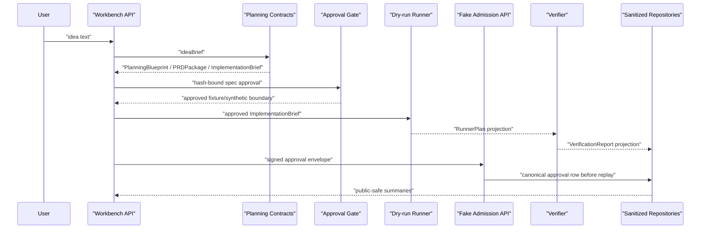

# Architecture

## Conclusion

`Agentic Workbench` is an Idea-to-App agent workflow harness. The current
implementation connects planning contracts, approval gates, dry-run runner
plans, verification reports, sanitized public projections, and persistence
boundaries. Current behavior is local/dev and fixture/dry-run/fake-boundary
only; target runtime execution remains closed.

## Current Layers

```text
API / Harness
  WorkflowSession, public projection, artifact registry, workflow events

Planning Contracts
  IdeaBrief, PlanningBlueprint, PRDPackage, BuildSpec, ImplementationBrief

Approval Boundary
  SpecApproval, approval/replay contracts, provider/live admission skeletons

Runner Boundary
  offline runner, dry-run RunnerPlan, gated fake live/provider paths

Verification Boundary
  VerificationReport with sanitized checks, counts, hashes, and metrics

Persistence Boundary
  sanitized in-memory repositories, file-backed replay fixture,
  SQLite skeletons for runner/report/audit, approval/replay, and canonical
  run/artifact projection rows, plus provider envelope evidence rows
```

## Current Flow



## Core Contracts

| Contract | Current purpose |
|---|---|
| `IdeaBrief` | normalize user intent without persisting raw prompt as public evidence |
| `PlanningBlueprint` | preserve planning, evidence, section, and visual intent |
| `PRDPackage` | bundle PRD, feature requirements, API requirements, and acceptance criteria |
| `ImplementationBrief` | handoff summary linked to `BuildSpec` by hash |
| `SpecApproval` | user approval or requested changes for a specific spec/brief hash |
| `RunnerPlan` | side-effect-free dry-run execution plan projection |
| `VerificationReport` | sanitized check/error/file/metric projection |
| repository records | hash/count/linkage rows that exclude raw prompt, raw body, logs, and provider payloads |
| `ProviderEnvelopeRecord` | no-call provider envelope evidence with contract hashes, counts, and status |
| `ProviderEnvelopeAdmissionService` | service boundary that requires envelope persistence/read-model evidence before adapter reachability |
| `ProviderEnvelopeRepositoryProvider` | API/demo repository selector for optional provider envelope precheck projections |
| `operator_approval_envelope` | local operator approval projection bound to a provider precheck policy summary hash |
| `live_provider_dry_admission` | local checklist projection showing manual preconditions and closed execution permission |
| `manual_provider_test_proposal` | local proposal gate with proposal hash, approval hash match, and execution disabled by default |
| `manual_provider_test_executor` | disabled executor projection with status, reason, and planned call hash only |
| `manual_provider_test_handoff_packet` | final no-call packet with status, reason, handoff hash, and counts only |
| `manual_provider_test_operator_opt_in` | local opt-in checklist bound to the handoff packet hash, still execution-closed |
| `manual_provider_test_sealed_pre_execution_packet` | local sealed packet over handoff, opt-in, policy, rollback, and abort hashes |
| `manual_provider_test_arming_record` | local arming record over sealed packet, operator, expiry, rollback, and abort hashes |
| `manual_provider_test_release_proposal` | local release proposal over arming record, operator, release window, and rollback hashes |
| `manual_provider_test_final_release_packet` | local final packet over release proposal, arming record, operator, release window, and rollback hashes |
| `manual_provider_test_execution_switch` | local disabled switch over final release packet and switch-enable hashes |
| `manual_provider_test_release_seal` | local disabled release seal over release-attestation, seal-material, claim-boundary, and no-call counter hashes |
| `manual_provider_test_execution_capsule` | local disabled execution capsule over release seal, final authorization, claim-boundary, and no-call counter hashes |
| `manual_provider_test_execution_capsule_export` | local disabled execution capsule export/read-model over execution capsule, export metadata, claim-boundary, and no-call counter hashes |
| `manual_provider_test_execution_capsule_handoff_packet` | local disabled execution capsule handoff packet over export, export read-model, claim-boundary, and no-call counter hashes |
| `manual_provider_test_execution_capsule_operator_review` | local disabled execution capsule operator review over handoff packet, operator-review, claim-boundary, and no-call counter hashes |
| `manual_provider_test_execution_capsule_operator_decision` | local disabled execution capsule operator decision over operator review, operator-decision, claim-boundary, and no-call counter hashes |
| `manual_provider_test_execution_capsule_release_attestation` | local disabled execution capsule release attestation over operator decision, release-attestation, claim-boundary, and no-call counter hashes |
| `manual_provider_test_execution_capsule_release_seal` | local disabled execution capsule release seal over release-attestation, seal-material, claim-boundary, and no-call counter hashes |
| `manual_provider_test_execution_capsule_final_authz` | local disabled execution capsule final authorization over release seal, final authorization, claim-boundary, and no-call counter hashes |
| `manual_provider_test_execution_capsule_authz_export` | local disabled execution capsule authz export/read-model over final authz, export metadata, claim-boundary, and no-call counter hashes |
| `manual_provider_test_execution_capsule_authz_handoff_packet` | local disabled execution capsule authz handoff packet over authz export, authz read-model, claim-boundary, and no-call counter hashes |
| `manual_provider_test_execution_capsule_authz_operator_review` | local disabled execution capsule authz operator review over authz handoff packet, operator-review, claim-boundary, and no-call counter hashes |
| `manual_provider_test_execution_capsule_authz_operator_decision` | local disabled execution capsule authz operator decision over authz operator-review, operator-decision, claim-boundary, and no-call counter hashes |
| `manual_provider_test_execution_capsule_authz_release_attestation` | local disabled execution capsule authz release attestation over authz operator-decision, release-attestation, claim-boundary, and no-call counter hashes |
| `manual_provider_test_execution_capsule_authz_release_seal` | local disabled execution capsule authz release seal over authz release-attestation, seal-material, claim-boundary, and no-call counter hashes |

## Persistence Boundary

The repository layer stores projection rows only. It may store identifiers,
hashes, counts, safe labels, timestamps, and sanitized summaries. It must not
store raw planned actions, raw logs, raw file bodies, provider/runtime payloads,
approval authorization material, secrets, or raw prompts.

The SQLite adapters are skeletons for local projection persistence. The
runner/report/audit store is separate from the approval/replay store so
execution evidence and admission evidence do not share one implicit trust
boundary. These adapters are not a production database layer, trust root,
hosted service, or external runtime result.

`AW-PERSIST-06` adds an explicit approval/replay repository factory and optional
SQLite-backed replay wiring for fake admission gates. `AW-PERSIST-07` adds a
canonical approval persistence service so provider/live admission can store the
approved subject snapshot and decision row before replay claim. This keeps the
default public API separate from DB selection while allowing future API/demo
paths to reuse the same approval persistence and replay contract. The service
stores canonical hash-bound rows only; fake admission still does not store raw
authorization material or call external provider/runtime surfaces.

`AW-API-01` adds sanitized fake admission API demo paths for provider and live
runner approval envelopes. These endpoints prove API/service wiring can call
`CanonicalApprovalPersistenceService` before replay claim and then return a
public projection with raw authorization fields removed. `AW-API-02` adds a
server-side repository selector so fake admission endpoints can explicitly use
SQLite approval/replay repositories across API requests. The existing fixture
run endpoint remains synthetic and separate from the durable approval demo path,
and does not create the admission SQLite store.

`AW-API-03` adds a read-only evidence API over the same sanitized projection
rows. `GET /api/v1/evidence/runs/{run_id}` returns runner plan, verification
report, audit event, approval, and replay projection rows as hashes, counts,
safe summaries, and linkage fields only. It does not expose raw repository rows,
local database paths, raw authorization material, provider payloads, logs, or
file bodies.

`AW-API-04` adds an optional write path from `/api/v1/runs` fixture output to
the configured local runner/report/audit evidence repository. The API persists a
fixture-derived dry-run runner plan projection, a verification report
projection, audit event projections, and artifact linkage rows only when
`EvidenceRepositoryConfig` is set. The fixture path remains synthetic and does
not write durable approval/replay rows.

`AW-API-05` adds repository-backed run and artifact read APIs over the same
local runner/report/audit evidence store. `GET /api/v1/runs/{run_id}` returns a
summary synthesized from projection rows, and
`GET /api/v1/runs/{run_id}/artifacts` returns artifact metadata rows. These
paths are evidence-backed skeletons, not canonical run-session APIs. They do
not query approval/replay repositories and do not return artifact payload
bodies.

`AW-PERSIST-08` adds a separate SQLite adapter skeleton for canonical
`RunSessionRecord` and `ArtifactRecord` rows. `/api/v1/runs` can persist the
sanitized run-session row and artifact metadata when a `RunArtifactRepository`
is explicitly configured. `GET /api/v1/runs/{run_id}` and
`GET /api/v1/runs/{run_id}/artifacts` now read from this canonical run/artifact
store. These paths do not query runner/report/audit evidence, approval/replay
evidence, external providers, or target runtimes.

ADR 0001 fixes the next read-model direction: canonical run state is the
primary run status source, and evidence may be composed only as a separate
sanitized summary section. The composition layer may query configured evidence
stores for counts, hashes, linkage status, checks, and blocked markers, but it
must not merge repository responsibilities or return raw rows. Missing evidence
must not block canonical run lookup; corrupted evidence should block only the
evidence summary section.

`AW-API-06` implements that direction for `GET /api/v1/runs/{run_id}`. The
endpoint now returns canonical run state and artifact metadata plus an optional
`evidence_summary`. `GET /api/v1/runs/{run_id}/artifacts` remains a canonical
artifact metadata endpoint. Evidence rows are summarized as counts, checks, and
linkage markers only.

`AW-DEMO-01` adds a local service-shaped demo over the same public API boundary.
The demo posts one idea to `/api/v1/runs`, persists configured local projection
rows, reads `/api/v1/runs/{run_id}`, and prints a sanitized summary. It does
not start a server, call providers, run DAACS target runtime, install packages,
or build generated applications.

`AW-DEMO-02` adds a minimal reviewer-facing Markdown/CLI status surface over the
`AW-DEMO-01` summary. The surface renders run state, artifact chain, source
identity signals, evidence counts, repository boundary, execution boundary,
claim boundary, and next action. It consumes public projections only and does
not read repository tables directly.

`AW-LIVE-00` adds a fail-closed live-open policy gate. The gate evaluates
readiness for future `solar_provider` and `daacs_target_runtime` work against
approval policy, replay persistence, cost/quota guard, timeout guard, workspace
sandbox, write allowlist, rollback plan, secret redaction, artifact sanitizer,
and audit projection controls. A passing decision is only
`eligible_for_separate_live_implementation`; it keeps execution permission
false and all provider/runtime counters at 0.

`AW-DEMO-03` adds a static HTML UI shell over the same sanitized public summary
used by the local demo and Markdown status surface. The shell renders run
overview, artifact chain, DIV/DAACS identity signals, evidence counts,
execution boundary counters, and the live-open policy state. It does not read
repository tables, start a server, call providers, or run target runtime code.

`AW-LIVE-01` adds a disabled Solar Pro 3 provider adapter skeleton. The adapter
can be registered under the `live` provider mode, but invocation remains
blocked. It requires a structured approval, an eligible live-open policy
decision, timeout config, cost/quota config, and token quota config before it
can move past early admission checks. Fake provider mode remains assigned to
`FakeSolarProProvider`; the disabled live adapter rejects fake mode.

`AW-LIVE-02` adds no-call Solar Pro 3 request/response contract fixtures. The
request fixture is based on `prompt_contract_hash`, timeout, cost, API quota,
and token quota policy. The response projection fixture contains sanitized
summary text and correlation hashes only. Raw input text, source body,
provider body, SDK imports, env value reads, network calls, and API calls remain
outside the contract path.

`AW-LIVE-03` adds provider envelope persistence and a public read model for
no-call Solar contract evidence. The SQLite store persists request and response
contract hashes, prompt/content hashes, counts, status, safe labels, and a
sanitized summary. The public read model narrows that to hashes, counts,
status, repository boundary state, and zero-call counters. Corrupted,
unavailable, or wrong-schema stores are blocked.

`AW-LIVE-04` adds a provider envelope admission service in front of the
disabled Solar adapter path. The service validates no-call contract evidence,
persists an envelope row, reads it back through the public read model, verifies
matching request/response hashes, and only then invokes the disabled adapter.
Missing service, hash mismatch, or corrupted store blocks before adapter
invocation. The adapter still blocks and provider/runtime calls remain at 0.

`AW-LIVE-05` exposes that admission boundary through optional local API and
demo read-model hooks. `POST /api/v1/admissions/provider/envelope/precheck`
can run the no-call admission chain when a server-side provider envelope store
is configured. `GET /api/v1/admissions/provider/envelopes/{run_id}` returns
the sanitized provider envelope read model. Both paths expose only status,
hashes, counts, safe checks, repository markers, and zero-call metrics.

`AW-LIVE-06` adds an explicit operator approval envelope before the precheck can
proceed. The operator approval references a sanitized policy summary hash that
covers timeout, cost, API quota, output budget, live-open readiness counts, and
zero-call boundaries. Missing or mismatched operator approval blocks before
provider envelope repository access and before disabled adapter reachability.

`AW-LIVE-07` adds a local dry-admission checklist projection and runbook. The
projection combines operator approval status, policy summary hash binding,
cost, timeout, API quota, output budget, rollback, final operator review, and
closed execution permission into a public response. It always reports
`status=dry_admission_only`, `live_ready=false`, and
`allowed_to_execute=false`. This makes the next manual decision visible without
opening provider SDK imports, env value reads, network calls, external API
calls, or DAACS target runtime calls.

`AW-LIVE-08` adds a manual provider test proposal gate. The gate hashes a
proposal containing run id, prompt contract hash, cost, timeout, API quota,
output budget, rollback id, and abort criteria hash/count. A separate operator
approval must reference that exact proposal hash. A matching approval can only
produce `status=approved_disabled`; it still reports `allowed_to_execute=false`
and keeps external calls closed.

`AW-LIVE-09` adds a disabled manual provider test executor boundary. The
executor projection is intentionally narrow and returns only `status`, `reason`,
and `planned_call_hash`. An accepted proposal without an executor flag reports
`executor_enable_required`. An accepted proposal with the flag still reports
`executor_disabled_by_default`. Both states keep provider SDK imports, env
value reads, network calls, external API calls, and DAACS target runtime calls
closed.

`AW-LIVE-10` adds a blocked one-shot permission contract projection. The
projection fingerprints a candidate run id, proposal hash, planned call hash,
cost, timeout, quota, rollback, abort criteria hash/count, and expiry, but it
returns only status, reason, hash, expiry, and count in public output. A valid
candidate still reports `executor_blocked`, so provider SDK imports, env value
reads, network calls, external API calls, and DAACS target runtime calls remain
closed.

`AW-LIVE-11` adds a blocked manual provider test preflight audit bundle. The
bundle combines the proposal hash, planned call hash, one-shot permission hash,
dry-admission checklist hash, and no-call counters into one public projection
that returns only status, reason, hash, and counts. A complete local candidate
still reports `preflight_execution_closed`; missing or mismatched components
return component-specific blocked reasons. No adapter, provider, or target
runtime path is opened.

`AW-LIVE-12` adds a blocked readiness decision record. The record binds a
private operator decision to the current preflight audit hash and represents
approve, reject, and defer as count fields. Public output remains limited to
status, reason, hash, and counts. Even an approve decision reports
`readiness_execution_closed`, keeps `execution_permission_count=0`, and does
not open provider or target runtime paths.

`AW-LIVE-13` adds a blocked review packet. The packet binds the policy summary
hash, preflight audit hash, and readiness decision hash into one local
operator-facing projection. Public output remains limited to status, reason,
hash, and counts. Even when the readiness decision is approve, the packet
reports `review_packet_execution_closed` and keeps
`execution_permission_count=0`.

`AW-LIVE-14` adds a review packet export/read-model. The export stores only
status, reason, review packet hash, export hash, and counts. `GET`
provider-envelope read paths can retrieve the stored packet evidence without
raw prompt, provider body, provider payload, or authorization material. An
expected packet hash mismatch blocks before adapter admission.

`AW-LIVE-15` adds a final no-call handoff packet. The packet summarizes policy
summary, preflight audit, readiness decision, review packet, and review packet
export evidence as status, reason, a handoff hash, and counts. Expected export
or handoff hash mismatch blocks before adapter admission. The packet is not an
execution permission and keeps `execution_permission_count=0`.

`AW-LIVE-16` adds a first live-call operator opt-in checklist boundary. The
checklist requires the handoff packet hash to exist, requires an explicit
operator opt-in payload, and binds that payload to the computed handoff hash.
Missing opt-in, mismatched handoff hash, invalid decision, or incomplete
operator fields remain blocked. A complete opt-in still reports
`operator_opt_in_execution_closed` and keeps `execution_permission_count=0`.

`AW-LIVE-17` adds a sealed pre-execution packet boundary. The packet requires a
computed operator opt-in hash and a separate expected operator opt-in hash
match. It then binds handoff, opt-in, cost/timeout/quota, and rollback/abort
hashes into one status/reason/hash/count projection. The packet still reports
`sealed_pre_execution_packet_execution_closed` and keeps
`execution_permission_count=0`.

`AW-LIVE-18` adds a no-call live execution arming record. The record requires a
sealed packet hash and a separate expected sealed packet hash match. It binds
operator, expiry, rollback, and abort policy evidence as hashes and counts
only. The record still reports `arming_record_execution_closed` and keeps
`execution_permission_count=0`.

`AW-LIVE-19` adds a no-call execution authorization release proposal. The
proposal requires an arming record hash and a separate expected arming record
hash match. It binds operator, release window, and rollback evidence as hashes
and counts only. The proposal still reports `release_proposal_execution_closed`
and keeps `execution_permission_count=0`.

`AW-LIVE-20` adds a no-call final release packet. The packet requires a release
proposal hash and a separate expected release proposal hash match. It binds the
release proposal, arming record, operator, release window, and rollback hashes
into one status/reason/hash/count projection. The packet still reports
`final_release_packet_execution_closed` and keeps
`execution_permission_count=0`.

`AW-LIVE-21` adds a disabled first-call execution switch. The switch requires a
final release packet hash and a separate expected final release packet hash
match. It also requires a separate local enable flag, but the complete switch
still reports `execution_switch_disabled_by_default` and keeps
`execution_permission_count=0`.

`AW-LIVE-22` adds a disabled first-call executor preflight. The preflight
requires an execution switch hash and a separate expected execution switch hash
match. It binds execution switch, final release packet, and no-call counter
hashes into one status/reason/hash/count projection. The preflight still
reports `executor_preflight_execution_closed` and keeps
`execution_permission_count=0`.

`AW-LIVE-23` adds a disabled first-call executor dispatch record. The record
requires an executor preflight hash and a separate expected executor preflight
hash match. It binds executor preflight, planned dispatch, and no-call counter
hashes into one status/reason/hash/count projection. The record still reports
`executor_dispatch_record_execution_closed` and keeps
`execution_permission_count=0`.

`AW-LIVE-24` adds a disabled first-call invocation receipt. The receipt
requires a dispatch record hash and a separate expected dispatch record hash
match. It binds dispatch record, result placeholder, and no-call counter hashes
into one status/reason/hash/count projection. The receipt still reports
`invocation_receipt_execution_closed` and keeps `execution_permission_count=0`.

`AW-LIVE-25` adds a disabled first-call post-invocation audit. The audit
requires an invocation receipt hash and a separate expected invocation receipt
hash match. It binds invocation receipt, claim-boundary, and no-call counter
hashes into one status/reason/hash/count projection. The audit still reports
`post_invocation_audit_execution_closed` and keeps
`execution_permission_count=0`.

`AW-LIVE-26` adds a disabled first-call completion summary. The summary
requires a post-invocation audit hash and a separate expected post-invocation
audit hash match. It binds post-invocation audit, claim-boundary, and no-call
counter hashes into one status/reason/hash/count projection. The summary still
reports `completion_summary_execution_closed` and keeps
`execution_permission_count=0`.

`AW-LIVE-27` adds a disabled first-call closeout record. The record requires a
completion summary hash and a separate expected completion summary hash match.
It binds completion summary, claim-boundary, and no-call counter hashes into
one status/reason/hash/count projection. The record still reports
`closeout_record_execution_closed` and keeps `execution_permission_count=0`.

`AW-LIVE-28` adds a disabled first-call operator handback. The handback
requires a closeout record hash and a separate expected closeout record hash
match. It binds closeout, operator-review, claim-boundary, and no-call counter
hashes into one status/reason/hash/count projection. The handback still
reports `operator_handback_execution_closed` and keeps
`execution_permission_count=0`.

`AW-LIVE-29` adds a disabled first-call operator decision packet. The packet
requires an operator handback hash and a separate expected operator handback
hash match. It binds handback, operator-decision, claim-boundary, and no-call
counter hashes into one status/reason/hash/count projection. The packet still
reports `operator_decision_packet_execution_closed` and keeps
`execution_permission_count=0`.

`AW-LIVE-30` adds a disabled first-call operator release attestation. The
attestation requires an operator decision packet hash and a separate expected
operator decision packet hash match. It binds decision packet,
operator-attestation, claim-boundary, and no-call counter hashes into one
status/reason/hash/count projection. The attestation still reports
`operator_release_attestation_execution_closed` and keeps
`execution_permission_count=0`.

`AW-LIVE-31` adds a disabled first-call release authorization seal. The seal
requires an operator release attestation hash and a separate expected operator
release attestation hash match. It binds release attestation, seal material,
claim-boundary, and no-call counter hashes into one status/reason/hash/count
projection. The seal still reports
`release_authorization_seal_execution_closed` and keeps
`execution_permission_count=0`.

`AW-LIVE-32` adds a disabled first-call execution authorization capsule. The
capsule requires a release seal hash and a separate expected release seal hash
match. It binds release seal, final authorization, claim-boundary, and no-call
counter hashes into one status/reason/hash/count projection. The capsule still
reports `execution_authorization_capsule_execution_closed` and keeps
`execution_permission_count=0`.

`AW-LIVE-33` adds a disabled first-call execution capsule export/read-model.
The export requires an execution capsule hash and a separate expected execution
capsule hash match. It binds execution capsule, export metadata,
claim-boundary, and no-call counter hashes into one status/reason/hash/count
projection. The export read model exposes only the latest export hash and
counts. The export still reports `execution_capsule_export_execution_closed`
and keeps `execution_permission_count=0`.

`AW-LIVE-34` adds a disabled first-call execution capsule handoff packet. The
packet requires an execution capsule export hash and a separate expected export
hash match. It binds execution capsule export, export read model,
claim-boundary, and no-call counter hashes into one status/reason/hash/count
projection. The packet still reports
`execution_capsule_handoff_packet_execution_closed` and keeps
`execution_permission_count=0`.

`AW-LIVE-35` adds a disabled first-call execution capsule operator review. The
review requires an execution capsule handoff packet hash and a separate
expected handoff packet hash match. It binds execution capsule handoff packet,
operator review, claim-boundary, and no-call counter hashes into one
status/reason/hash/count projection. The review still reports
`execution_capsule_operator_review_execution_closed` and keeps
`execution_permission_count=0`.

`AW-LIVE-36` adds a disabled first-call execution capsule operator decision. The
decision requires an execution capsule operator review hash and a separate
expected operator review hash match. It binds execution capsule operator
review, operator decision, claim-boundary, and no-call counter hashes into one
status/reason/hash/count projection. The decision still reports
`execution_capsule_operator_decision_execution_closed` and keeps
`execution_permission_count=0`.

`AW-LIVE-37` adds a disabled first-call execution capsule release attestation.
The attestation requires an execution capsule operator decision hash and a
separate expected operator decision hash match. It binds execution capsule
operator decision, release-attestation, claim-boundary, and no-call counter
hashes into one status/reason/hash/count projection. The attestation still
reports `execution_capsule_release_attestation_execution_closed` and keeps
`execution_permission_count=0`.

`AW-LIVE-38` adds a disabled first-call execution capsule release seal. The
seal requires an execution capsule release attestation hash and a separate
expected release attestation hash match. It binds execution capsule release
attestation, seal-material, claim-boundary, and no-call counter hashes into one
status/reason/hash/count projection. The seal still reports
`execution_capsule_release_seal_execution_closed` and keeps
`execution_permission_count=0`.

`AW-LIVE-39` adds a disabled first-call execution capsule final authorization.
The authorization requires an execution capsule release seal hash and a separate
expected release seal hash match. It binds release-seal, final-authorization,
claim-boundary, and no-call counter hashes into one status/reason/hash/count
projection. Public field names use `final_authz` to preserve the sanitizer
boundary. The authorization still reports
`execution_capsule_final_authz_execution_closed` and keeps
`execution_permission_count=0`.

`AW-LIVE-40` adds a disabled first-call execution capsule authz export/read-model.
The export requires an execution capsule final authz hash and a separate
expected final authz hash match. It binds final-authz, export metadata,
claim-boundary, and no-call counter hashes into one status/reason/hash/count
projection. The read-model exposes only the latest authz export hash and
counts. The export still reports `execution_capsule_authz_export_execution_closed`
and keeps `execution_permission_count=0`.

`AW-LIVE-41` adds a disabled first-call execution capsule authz handoff packet.
The packet requires an execution capsule authz export hash and a separate
expected authz export hash match. It binds authz export, authz export
read-model, claim-boundary, and no-call counter hashes into one
status/reason/hash/count projection. The packet still reports
`execution_capsule_authz_handoff_packet_execution_closed` and keeps
`execution_permission_count=0`.

`AW-LIVE-42` adds a disabled first-call execution capsule authz operator
review. The review requires an execution capsule authz handoff packet hash and
a separate expected authz handoff packet hash match. It binds authz handoff,
operator-review, claim-boundary, and no-call counter hashes into one
status/reason/hash/count projection. The review still reports
`execution_capsule_authz_operator_review_execution_closed` and keeps
`execution_permission_count=0`.

`AW-LIVE-43` adds a disabled first-call execution capsule authz operator
decision. The decision requires an execution capsule authz operator review hash
and a separate expected authz operator review hash match. It binds authz
operator-review, operator-decision, claim-boundary, and no-call counter hashes
into one status/reason/hash/count projection. The decision still reports
`execution_capsule_authz_operator_decision_execution_closed` and keeps
`execution_permission_count=0`.

`AW-LIVE-44` adds a disabled first-call execution capsule authz release
attestation. The attestation requires an execution capsule authz operator
decision hash and a separate expected authz operator decision hash match. It
binds authz operator-decision, release-attestation, claim-boundary, and
no-call counter hashes into one status/reason/hash/count projection. The
attestation still reports
`execution_capsule_authz_release_attestation_execution_closed` and keeps
`execution_permission_count=0`.

`AW-LIVE-45` adds a disabled first-call execution capsule authz release seal.
The seal requires an execution capsule authz release attestation hash and a
separate expected authz release attestation hash match. It binds authz
release-attestation, seal-material, claim-boundary, and no-call counter hashes
into one status/reason/hash/count projection. The seal still reports
`execution_capsule_authz_release_seal_execution_closed` and keeps
`execution_permission_count=0`.

## Target-Only Runtime

Future work may connect live provider calls and runtime execution after explicit
approval, replay protection, verifier policy, and durable persistence are
complete. A configured provider API key is not sufficient to open live
execution. Provider and target runtime calls require the `AW-LIVE-00` policy
gate to report eligibility and still require a separate implementation unit
with cost, quota, timeout, sandbox, write allowlist, rollback, redaction,
artifact sanitizer, and audit controls. Those surfaces are intentionally
outside the current executable path.

## Risk Controls

- planning/research gaps are represented as missing evidence, not workflow
  success claims.
- public artifacts expose sanitized summaries and hashes, not raw content.
- fixture/synthetic approval is separate from durable user approval.
- runner/provider/live paths are blocked unless their specific gates pass.
- repository rows are checked for forbidden public keys and unsupported claims.
- SQLite writes use constraints and transactions for sanitized projection rows.
- SQLite approval/replay rows keep immutable subject/decision hashes and
  replay nonce hashes only; raw authorization material is rejected.
- fake admission wiring may choose SQLite replay storage through the canonical
  approval persistence service, but external calls and target runtime calls
  remain at 0 in current paths.
- API fake admission responses expose only hashes, counts, safe checks, and
  zero-call metrics; raw signature, nonce, and signed contract fields stay out
  of public output.
- API fake admission may report the selected repository backend and persistence
  marker, but never returns local database root paths.
- evidence read-model API paths are read-only and keep provider/runtime calls at
  0.
- fixture evidence persistence writes local projection rows only when explicitly
  configured, and corrupted stores are reported as blocked without raw/path
  echo.
- canonical run/artifact read APIs expose stored run-session and artifact
  metadata projection rows only, keep evidence/admission rows out of the
  response, and keep provider/runtime calls at 0.
- composed run/evidence read APIs keep canonical run state primary and attach
  evidence as sanitized counts, checks, and linkage markers only.
- local service-shaped demo scripts must consume public API projections and
  keep provider/runtime calls at 0.
- run status surfaces must render sanitized projection summaries only and must
  not become a second source of truth.
- live-open policy decisions must stay side-effect-free, keep
  `allowed_to_execute=false`, and never read env values.
- static UI shells must consume public summaries only and keep provider/runtime
  counters at 0.
- disabled Solar Pro 3 adapters must keep fake and live modes separate, never
  read env values, never import provider SDKs, and keep provider call counters
  at 0.
- Solar Pro 3 contract fixtures must be no-call projections and must not carry
  raw input text, source body, provider body, or authorization material.
- provider envelope read models must expose hashes, counts, and status only;
  corrupted or unavailable stores must be blocked without path or raw row echo.
- provider envelope admission services must block before adapter invocation
  when evidence persistence, read-model lookup, or hash matching fails.
- provider envelope API/demo hooks must stay optional, keep fixture/dry-run run
  creation separate, and return only status/hash/count projections.
- operator approval envelopes must bind to a sanitized policy summary hash and
  must not expose raw authorization material or grant execution permission.
- dry-admission checklist projections must show manual preconditions while
  keeping `live_ready=false`, `allowed_to_execute=false`, and all
  provider/runtime counters at 0.
- manual provider test proposal gates must bind proposal approval by hash and
  must stay disabled by default even when the proposal is accepted.
- manual provider test executor projections must stay blocked and must expose
  only status, reason, and planned call hash.
- manual provider test handoff packets must remain no-call projections over
  sanitized policy/preflight/readiness/review/export evidence and must not
  grant execution permission.
- operator opt-in checklists must bind to the no-call handoff packet hash and
  must not grant execution permission.
- sealed pre-execution packets must bind to no-call evidence hashes only and
  must not grant execution permission.
- arming records must bind to sealed packet and operator intent hashes only
  and must not grant execution permission.
- release proposals must bind to arming record, operator, release window, and
  rollback hashes only and must not grant execution permission.
- final release packets must bind to release proposal, arming record, operator,
  release window, and rollback hashes only and must not grant execution
  permission.
- execution switches must bind to final release packet and switch-enable hashes
  only and must not grant execution permission.
- executor preflights must bind to execution switch and no-call counter hashes
  only and must not grant execution permission.
- executor dispatch records must bind to executor preflight, planned dispatch,
  and no-call counter hashes only and must not grant execution permission.
- invocation receipts must bind to dispatch record, result placeholder, and
  no-call counter hashes only and must not grant execution permission.
- post-invocation audits must bind to invocation receipt, claim-boundary, and
  no-call counter hashes only and must not grant execution permission.
- completion summaries must bind to post-invocation audit, claim-boundary, and
  no-call counter hashes only and must not grant execution permission.
- closeout records must bind to completion summary, claim-boundary, and
  no-call counter hashes only and must not grant execution permission.
- operator handbacks must bind to closeout, operator-review, claim-boundary,
  and no-call counter hashes only and must not grant execution permission.
- operator decision packets must bind to handback, operator-decision,
  claim-boundary, and no-call counter hashes only and must not grant execution
  permission.
- operator release attestations must bind to decision packet,
  operator-attestation, claim-boundary, and no-call counter hashes only and
  must not grant execution permission.
- release authorization seals must bind to release attestation, seal-material,
  claim-boundary, and no-call counter hashes only and must not grant execution
  permission.
- execution authorization capsules must bind to release seal, final
  authorization, claim-boundary, and no-call counter hashes only and must not
  grant execution permission.
- execution capsule exports/read models must bind to execution capsule, export
  metadata, claim-boundary, and no-call counter hashes only and must not grant
  execution permission.
- execution capsule handoff packets must bind to execution capsule export,
  export read-model, claim-boundary, and no-call counter hashes only and must
  not grant execution permission.
- execution capsule operator reviews must bind to execution capsule handoff
  packet, operator-review, claim-boundary, and no-call counter hashes only and
  must not grant execution permission.
- execution capsule operator decisions must bind to execution capsule operator
  review, operator-decision, claim-boundary, and no-call counter hashes only
  and must not grant execution permission.
- execution capsule release attestations must bind to execution capsule
  operator decision, release-attestation, claim-boundary, and no-call counter
  hashes only and must not grant execution permission.
- execution capsule release seals must bind to execution capsule release
  attestation, seal-material, claim-boundary, and no-call counter hashes only
  and must not grant execution permission.
- execution capsule final authorization must bind to execution capsule release
  seal, final-authorization material, claim-boundary, and no-call counter hashes
  only and must not grant execution permission.
- execution capsule authz exports must bind to execution capsule final authz,
  export metadata, claim-boundary, and no-call counter hashes only and must not
  grant execution permission.
- execution capsule authz handoff packets must bind to execution capsule authz
  export, authz export read-model, claim-boundary, and no-call counter hashes
  only and must not grant execution permission.
- execution capsule authz operator reviews must bind to execution capsule
  authz handoff packet, operator-review, claim-boundary, and no-call counter
  hashes only and must not grant execution permission.
- execution capsule authz operator decisions must bind to execution capsule
  authz operator-review, operator-decision, claim-boundary, and no-call counter
  hashes only and must not grant execution permission.
- execution capsule authz release attestations must bind to execution capsule
  authz operator-decision, release-attestation, claim-boundary, and no-call
  counter hashes only and must not grant execution permission.
- execution capsule authz release seals must bind to execution capsule authz
  release-attestation, seal-material, claim-boundary, and no-call counter
  hashes only and must not grant execution permission.
