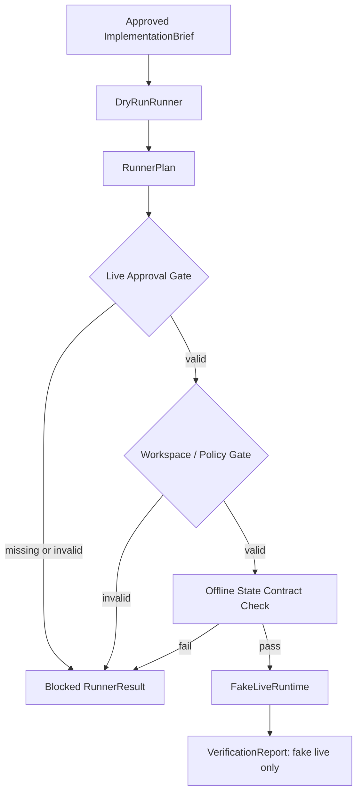

# AW-NEXT-08 Live Runner Gated Skeleton

## Conclusion

AW-NEXT-08은 실제 DAACS 실행이 아니라, 승인된 dry-run 산출물과 `ApprovalRecord`를 검증한 뒤 `FakeLiveRuntime`만 호출하는 gated live skeleton이다.

## Scope

포함:

- `LiveRunnerProvider` 기본 registry 등록
- `FakeLiveRuntime` 연결
- live 요청의 `ApprovalRecord` 필드 검증
- dry-run `RunnerPlan` 선행 증거 검증
- approval workspace와 runner policy workspace 일치 검증
- fake live 성공 경로의 side-effect 0 검증
- real DAACS, Solar Pro 3, provider, subprocess, package install, server start, filesystem write, network 호출 금지 테스트

제외:

- 실제 DAACS runtime import
- Solar Pro 3 API 호출
- provider gateway 구현
- package install
- local server start
- generated code 생성
- hosted/production success claim

## Implemented Boundary



## Gate Coverage

| Gate | Result |
|---|---|
| unknown runner mode blocked | covered |
| live without approval blocked | covered |
| malformed approval blocked | covered |
| live without dry-run plan blocked | covered |
| unsafe `run_id` blocked without public exposure | covered |
| approval `run_id` mismatch blocked | covered |
| approval `mode != live` blocked | covered |
| non-fake allowed operation blocked | covered |
| provider/subprocess/package/server/write limit above 0 blocked | covered |
| expired or non-forward approval window blocked | covered |
| missing rollback/audit ID blocked | covered |
| unsafe workspace root blocked | covered |
| policy escalation blocked | covered |
| dry-run plan hash/state mismatch blocked | covered |
| fake live success path side effects 0 | covered |
| process/file/network tripwire | covered |
| DAACS/provider import tripwire | covered |
| public payload sanitization | covered |

## Quantitative Result

| Metric | Value |
|---|---:|
| Pytest collected cases | 121 |
| Pytest passed cases | 121 |
| Regression delta vs AW-NEXT-07B baseline | +27 |
| Runner provider registry tests | 42 |
| New AW-NEXT-08 live/fake tests | 27 |
| Unsafe `run_id` public exposure regression cases | 1 |
| Approval validation negative cases | 13 |
| Workspace boundary negative cases | 6 |
| Tripwire tests | 3 |
| Default registered runner modes | 3 |
| Fake live runtime invocations on approved fake path | 1 |
| Real DAACS invocations on approved fake path | 0 |
| Solar/provider calls on approved fake path | 0 |
| Executed actions on approved fake path | 0 |
| Live LLM calls during eval | 0 |
| Live API calls during eval | 0 |
| Provider calls during eval | 0 |
| Provider imports during eval | 0 |
| CLI agent invocations during eval | 0 |
| Subprocess calls during eval | 0 |
| Package install calls during eval | 0 |
| Server start calls during eval | 0 |
| Filesystem writes during eval | 0 |
| Network calls during eval | 0 |
| Raw secret exposure in tested public payload | 0 |

## Audit Notes

사실:

- `live` mode는 이제 registry에 등록되어 있지만, 실행 대상은 `FakeLiveRuntime`으로 제한된다.
- 승인된 fake live 경로도 `generated_files=[]`, `artifact_manifest=[]`, `executed_action_count=0`을 반환한다.
- audit event는 approval/state/plan hash만 남기며 raw state, raw approval payload, raw file content를 남기지 않는다.

판단:

- AW-NEXT-08은 `live runner 구현 완료`가 아니라 `live runner admission gate skeleton`으로 표현해야 한다.
- real DAACS와 Solar Pro 3는 아직 연결하면 안 된다. 다음 단계에서도 provider boundary를 먼저 분리해야 한다.

남은 리스크:

- `ApprovalRecord`의 서명, 사용자 인증, replay 방지는 아직 없다.
- 실제 filesystem write가 열리는 순간 workspace boundary를 OS-level isolation과 함께 다시 검증해야 한다.
- provider budget, timeout, retry, telemetry는 AW-NEXT-09 이후 별도 계약이 필요하다.

## Verification

```text
python -m compileall packages apps tests
.\scripts\verify.ps1
121 passed
```
