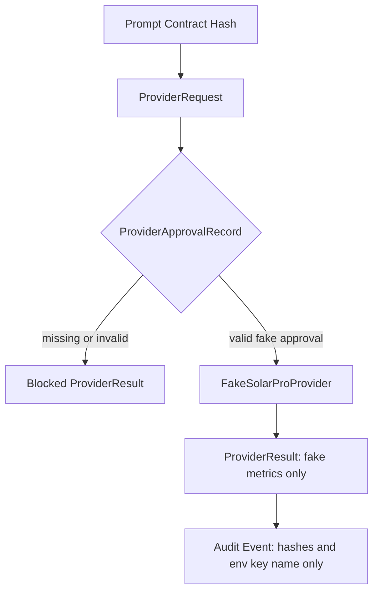

# AW-NEXT-09 Solar Pro 3 Provider Boundary

## Conclusion

AW-NEXT-09은 Solar Pro 3 실제 호출이 아니라, provider adapter 계약과 fake provider boundary만 추가한 단계다. `.env`에 API key가 있더라도 값은 읽지 않고, 공개 계약에는 `UPSTAGE_API_KEY`라는 env key 이름만 남긴다.

## Scope

포함:

- `ProviderRequest`, `ProviderApprovalRecord`, `ProviderResult`, `LLMProvider` 계약
- `FakeSolarProProvider` skeleton
- approval 없는 provider boundary 차단
- fake provider metrics 기록
- `.env`/env secret value 미읽기 테스트
- Solar/Upstage/provider runtime import 금지 테스트
- offline/dry-run 경로의 provider import 0 회귀 테스트

제외:

- Solar Pro 3 API 호출
- Upstage SDK import
- `.env` 값 로드
- prompt 원문 provider 전달
- real provider usage, token, latency claim
- DAACS live runtime 실행

## Boundary Flow



## Gate Coverage

| Gate | Result |
|---|---|
| provider approval missing blocked | covered |
| malformed provider approval blocked | covered |
| approval/request run_id mismatch blocked | covered |
| provider/model mismatch blocked | covered |
| non-fake mode blocked | covered |
| non-`UPSTAGE_API_KEY` env key blocked | covered |
| live api/llm call limits above 0 blocked | covered |
| expired or non-forward approval window blocked | covered |
| audit ID missing blocked | covered |
| unsafe `run_id` blocked without public exposure | covered |
| invalid prompt contract hash blocked | covered |
| fake provider success path live calls 0 | covered |
| `.env`/env secret value read tripwire | covered |
| network/file read tripwire | covered |
| Solar/Upstage/provider import tripwire | covered |
| offline/dry-run provider import 0 | covered |
| public payload contains env key name only | covered |

## Quantitative Result

| Metric | Value |
|---|---:|
| Pytest collected cases | 148 |
| Pytest passed cases | 148 |
| Regression delta vs AW-NEXT-08 baseline | +27 |
| New provider boundary test cases | 27 |
| Provider/request negative cases | 22 |
| Unsafe `run_id` public exposure regression cases | 1 |
| Secret/env read tripwire tests | 2 |
| Provider import tripwire tests | 2 |
| Offline/dry-run provider import regression tests | 1 |
| Fake provider invocations on approved fake path | 1 |
| Live LLM calls during eval | 0 |
| Live API calls during eval | 0 |
| Provider calls during eval | 0 |
| Provider imports during eval | 0 |
| Provider secret value reads during eval | 0 |
| Network calls during eval | 0 |
| `.env` file reads during eval | 0 |
| Raw secret exposure in tested public payload | 0 |

## Audit Notes

사실:

- `FakeSolarProProvider`는 `UPSTAGE_API_KEY` 값을 읽지 않는다.
- provider request는 prompt 원문이 아니라 `prompt_contract_hash`만 받는다.
- provider result와 audit event는 approval hash, prompt hash, provider/model, env key name만 남긴다.
- offline/dry-run 경로는 Solar/Upstage/provider runtime import 없이 유지된다.

판단:

- AW-NEXT-09은 provider boundary skeleton이지 Solar Pro 3 live integration이 아니다.
- `.env`에 실제 key가 있어도 이번 단계의 검증 대상은 key 존재나 호출 성공이 아니라 secret non-exposure와 fake boundary admission이다.

남은 리스크:

- 실제 Upstage SDK adapter, retry, rate limit, timeout, token usage, cost telemetry는 아직 없다.
- provider approval의 서명, 사용자 인증, replay 방지는 아직 없다.
- real provider response sanitization은 실제 adapter 단계에서 별도 감사가 필요하다.

## Verification

```text
python -m pytest tests/unit/test_provider_boundary.py -q
python -m compileall packages apps tests
.\scripts\verify.ps1
148 passed
```
