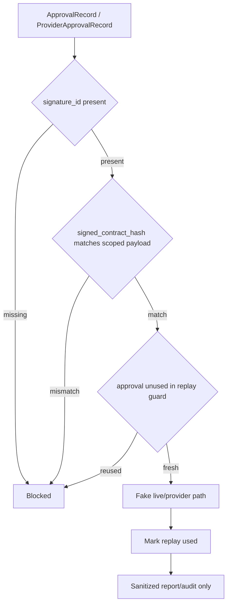

# AW-NEXT-10 ProviderApproval Signature / Nonce Gate

## Conclusion

AW-NEXT-10은 provider/live approval의 구조적 서명 검증과 nonce replay 차단 skeleton을 추가한 단계다. 실제 cryptographic signing, identity provider, persistent nonce store, Solar Pro 3 API 호출, DAACS live 실행은 아직 열지 않는다.

## Scope

포함:

- `ApprovalRecord`와 `ProviderApprovalRecord`에 `signature_id`, `signed_contract_hash`, `nonce` 추가
- approval payload와 scope를 묶는 internal canonical `signed_contract_hash` 검증
- fake live runner와 fake provider boundary의 reused nonce 차단
- fresh provider/registry instance에서도 process-local replay guard 공유
- unsigned approval 차단
- signed 후 payload가 바뀐 approval 차단
- public report/audit/output에서 signature field 값과 field name 비노출 검증

제외:

- real cryptographic signature verification
- signing secret/key file/env value read
- persistent replay store
- external identity provider
- Solar Pro 3 live call
- DAACS live runtime execution

## Boundary Flow



## Gate Coverage

| Gate | Result |
|---|---|
| provider unsigned approval blocked | covered |
| provider tampered signed approval blocked | covered |
| provider reused nonce blocked | covered |
| live unsigned approval blocked | covered |
| live tampered signed approval blocked | covered |
| live reused nonce blocked | covered |
| fresh provider/registry instance reused nonce blocked | covered |
| malformed signature envelope blocked | covered |
| expired approval blocked 유지 | covered by existing provider/live expiry fixtures |
| approval hash/audit event secret exposure 0 | covered in public payload tests |

## Quantitative Result

| Metric | Value |
|---|---:|
| Pytest collected cases | 162 |
| Pytest passed cases | 162 |
| Regression delta vs AW-NEXT-09 baseline | +14 |
| Provider boundary test cases | 34 |
| Runner provider registry tests | 49 |
| New approval signature/replay tests | 14 |
| Unsigned approval block fixtures | 2 |
| Tampered signed approval block fixtures | 2 |
| Reused nonce block fixtures | 4 |
| Malformed signature envelope fixtures | 6 |
| Live LLM calls during eval | 0 |
| Live API calls during eval | 0 |
| Provider calls during eval | 0 |
| Provider imports during eval | 0 |
| Network calls during eval | 0 |
| `.env` file reads during eval | 0 |

## Audit Notes

사실:

- approval signing skeleton은 `.env`, key file, network, provider SDK를 읽지 않는다.
- `signature_id`는 raw signature나 secret이 아니라 safe reference field다.
- `signed_contract_hash`는 approval scope와 payload를 묶는 internal canonical contract hash다.
- replay guard는 process-local in-memory set이며 기본 provider/registry instance 사이에서 공유된다.
- fake provider와 fake live runner 모두 첫 성공 후 동일 nonce 재사용을 차단한다.
- public runtime output은 `signature_id`, `nonce`, `signed_contract_hash` 값과 field name을 내보내지 않는다.

판단:

- 이번 단계는 실제 운영 서명 검증이 아니라 gate 위치와 실패 동작을 고정하는 skeleton으로 적절하다.
- real live/provider 실행 전에 persistent replay store와 실제 verifier interface가 추가되어야 한다.

남은 리스크:

- process restart 후 nonce 사용 이력이 사라진다.
- signing key rotation, verifier identity, clock skew 정책이 없다.
- `signed_contract_hash`는 canonical hash binding일 뿐 실제 비대칭/대칭 서명 검증이 아니다.
- approval hash가 production-grade non-repudiation evidence가 되지는 않는다.

## Verification

```text
python -m pytest tests/unit/test_provider_boundary.py -q
python -m pytest tests/unit/test_runner_provider_registry.py -q
python -m pytest tests -q
162 passed
```
