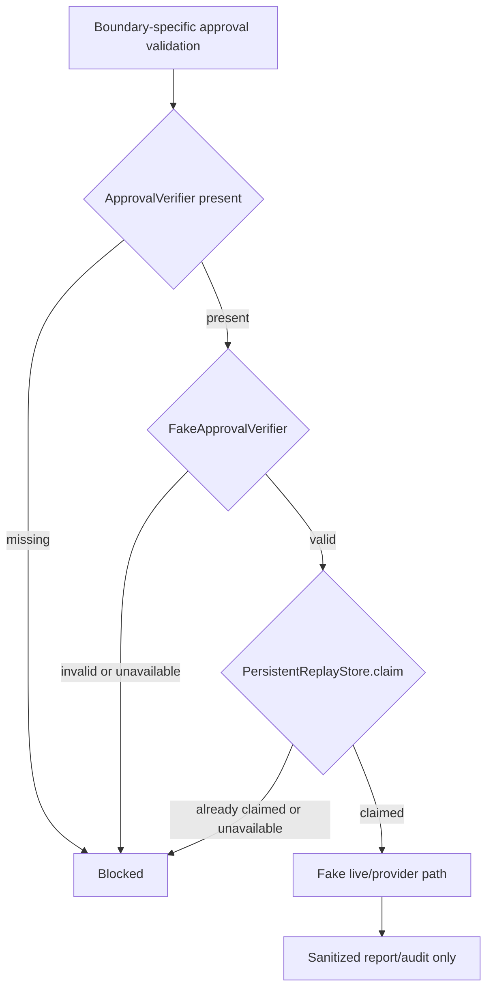

# AW-NEXT-11 PersistentReplayStore / ApprovalVerifier

## Conclusion

AW-NEXT-11은 real provider/live 실행을 열지 않고, approval verifier와 replay store 경계를 fail-closed로 고정한 단계다. replay persistence는 export/import 기반 restart simulation skeleton이며, 운영용 disk/DB durability나 cryptographic verifier는 아직 구현하지 않는다.

## Scope

포함:

- `ApprovalVerifier` protocol
- `FakeApprovalVerifier`
- `PersistentReplayStore`
- verifier 미주입 차단
- verifier exception 차단
- replay store exception 차단
- replay record export/import restart simulation
- provider/live scope isolation
- verifier/store public error leakage 방지

제외:

- real cryptographic signing
- signing secret/key file/env value read
- disk/DB-backed replay persistence
- external identity provider
- Solar Pro 3 live call
- DAACS live runtime execution

## Boundary Flow



## Gate Coverage

| Gate | Result |
|---|---|
| provider without verifier blocked | covered |
| live without verifier blocked | covered |
| verifier exception blocked | covered |
| replay store exception blocked | covered |
| process restart simulation reused authorization blocked | covered |
| provider/live replay scope isolation | covered |
| verifier secret/key/env read count 0 | covered |
| Solar Pro 3/DAACS live call 0 | covered |

## Quantitative Result

| Metric | Value |
|---|---:|
| Pytest collected cases | 172 |
| Pytest passed cases | 172 |
| Regression delta vs AW-NEXT-10 baseline | +10 |
| Approval security unit tests | 2 |
| Provider boundary test cases | 38 |
| Runner provider registry tests | 53 |
| New verifier/replay tests | 10 |
| Live LLM calls during eval | 0 |
| Live API calls during eval | 0 |
| Provider calls during eval | 0 |
| Provider imports during eval | 0 |
| Network calls during eval | 0 |
| Verifier secret value reads | 0 |
| Verifier key file reads | 0 |

## Audit Notes

사실:

- verifier가 없으면 provider/live approval은 blocked 된다.
- fake verifier는 `.env`, key file, network, provider SDK를 읽지 않는다.
- replay store export는 raw nonce 대신 scoped hash record만 남긴다.
- replay claim은 `claim(scope, nonce)` 단일 호출로 수행된다.
- provider/live semantic validation은 각 boundary에 남아 있고, verifier는 approval envelope 검증만 맡는다.

판단:

- AW-NEXT-11은 real approval infrastructure가 아니라 verifier/store boundary skeleton이다.
- 실제 live/provider 실행 전에는 disk/DB-backed replay persistence, verifier key trust root, revocation/rotation policy가 필요하다.

남은 리스크:

- process restart simulation은 export/import로만 검증했다. 자동 file/DB persistence는 없다.
- `FakeApprovalVerifier`는 실제 cryptographic verification이 아니다.
- 동시성은 in-memory set 기반 단일 프로세스 수준만 다룬다.

## Verification

```text
python -m pytest tests/unit/test_approval_security.py -q
python -m pytest tests/unit/test_provider_boundary.py -q
python -m pytest tests/unit/test_runner_provider_registry.py -q
python -m pytest tests -q
172 passed
```
