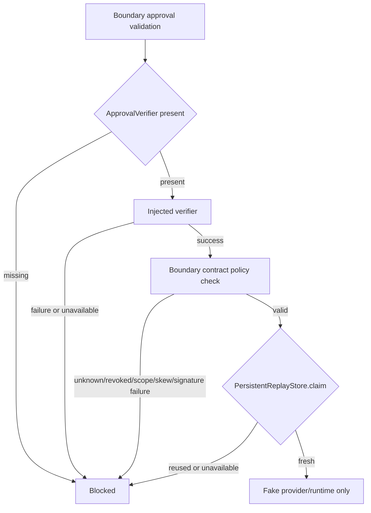

# AW-NEXT-12 ApprovalVerifier Policy / Key Identity

## Conclusion

AW-NEXT-12는 real provider/live 실행을 열지 않고, approval verifier policy와 key identity skeleton을 fail-closed로 고정한 단계다. provider/live boundary는 커스텀 verifier가 성공을 반환해도 최소 signature, verifier trust, key trust, scope, timestamp skew 계약을 다시 검사한다.

## Scope

포함:

- `ApprovalVerifierPolicy`
- approval envelope의 `verifier_id`, `key_id`, `verifier_scope`
- unknown verifier/key 차단
- revoked verifier/key 차단
- provider/live scope mismatch 차단
- future `approved_at` skew 차단
- custom verifier가 policy check를 생략해도 boundary-level contract 재검사
- public result/audit의 verifier/key/signature/nonce/hash 값 비노출

제외:

- production key registry
- key rotation
- external identity provider
- HSM/KMS-backed signature verification
- Solar Pro 3 live call
- DAACS live runtime execution

## Boundary Flow



## Gate Coverage

| Gate | Result |
|---|---|
| provider unknown verifier blocked | covered |
| provider revoked verifier blocked | covered |
| provider unknown key blocked | covered |
| provider revoked key blocked | covered |
| provider scope mismatch blocked | covered |
| provider future `approved_at` skew blocked | covered |
| live unknown verifier blocked | covered |
| live revoked verifier blocked | covered |
| live unknown key blocked | covered |
| live revoked key blocked | covered |
| live scope mismatch blocked | covered |
| live future `approved_at` skew blocked | covered |
| custom verifier policy bypass blocked | covered |
| cross-boundary signed approval reuse blocked | covered |
| Solar Pro 3/DAACS live call 0 | covered |

## Quantitative Result

| Metric | Value |
|---|---:|
| Pytest collected cases | 201 |
| Pytest passed cases | 201 |
| Regression delta vs AW-NEXT-11 baseline | +29 |
| Approval security unit tests | 3 |
| Provider boundary test cases | 52 |
| Runner provider registry tests | 67 |
| New verifier policy/key identity test cases | 29 |
| Provider policy block fixtures | 7 |
| Live policy block fixtures | 7 |
| Custom verifier contract fixtures | 12 |
| Cross-boundary signature reuse fixtures | 2 |
| Direct verifier metric regression tests | 1 |
| Live LLM calls during eval | 0 |
| Live API calls during eval | 0 |
| Provider calls during eval | 0 |
| Provider imports during eval | 0 |
| Network calls during eval | 0 |
| Verifier secret value reads | 0 |
| Verifier key file reads | 0 |

## Audit Notes

사실:

- verifier policy checks are enforced in `approval_security`, then consumed by provider/live boundaries.
- provider/live boundaries call `enforce_approval_contract_policy` after injected verifier success.
- fake provider/runtime invocation remains 0 for policy failures.
- cross-boundary signature reuse fails because the approval scope is part of the signed contract hash.

판단:

- AW-NEXT-12 closes the main skeleton-level bypass where a permissive custom verifier could skip policy checks.
- It is still not a production trust system. The next production-relevant step is a policy resolver with stable policy IDs and durable replay storage.

남은 리스크:

- Trusted IDs are static local tuples, not a durable registry.
- Revocation is test-local configuration, not centrally persisted.
- Timestamp skew uses local system time.
- No real cryptographic verifier or key material is used.

## Verification

```text
python -m pytest tests/unit/test_approval_security.py tests/unit/test_provider_boundary.py tests/unit/test_runner_provider_registry.py -q
122 passed

python -m pytest tests -q
201 passed
```
