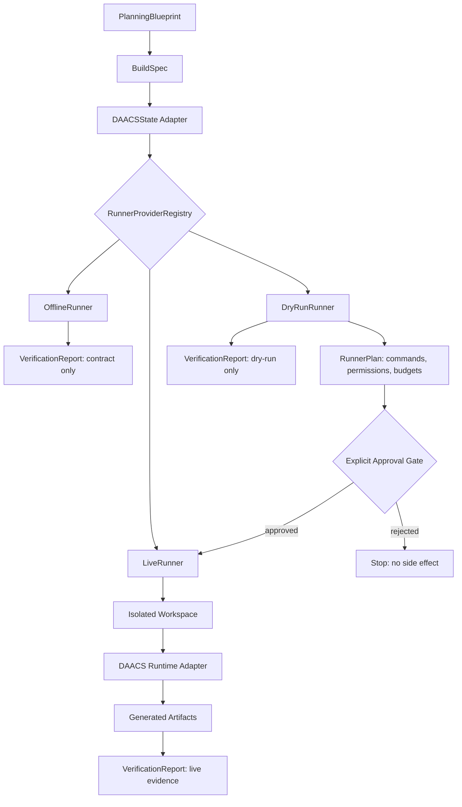

# Runner Provider Boundary

## Conclusion

다음 단계는 DAACS live 실행이 아니라 `offline runner`, `dry-run runner`, `live runner`를 동일한 provider 계약 아래 분리하는 것이다. Solar Pro 3와 DAACS 실제 실행은 이 경계가 고정된 뒤 별도 provider로 연결한다.

## Problem

현재 `DAACSOfflineRunner`는 mapped DAACSState를 받아 실행면을 열지 않는 검증 경계다. 다음 위험은 이 경계 위에 live provider call, CLI agent, package install, server start를 직접 붙이면서 offline 검증과 live 실행 책임이 섞이는 것이다.

## Design Decision

`RunnerProvider`를 공통 interface로 두고, runner mode별 책임을 분리한다.

| Mode | Responsibility | Allowed side effects | DAACS import | Provider call | Output |
|---|---|---:|---:|---:|---|
| `offline` | state contract와 차단 정책 검증 | 0 | no | no | `VerificationReport` |
| `dry_run` | 실행 계획, 권한 요청, 예상 산출물 manifest 생성 | 0 | no | no | `RunnerPlan` + `VerificationReport` |
| `live` | 승인된 격리 workspace에서 DAACS 실행 | explicit only | yes, delayed | explicit only | generated files + `VerificationReport` |

핵심 판단: `dry_run`은 "mock execution"이 아니라 "live 실행 전에 무엇을 실행할지 설명하는 계획 산출 단계"여야 한다. 그래야 package install, server start, provider call이 실제로 한 번도 발생하지 않은 상태에서 승인 기준을 검토할 수 있다.

## Boundary Layers

| Layer | Responsibility | Forbidden responsibility |
|---|---|---|
| `StateAdapter` | `BuildSpec -> RunnerInputState` deterministic mapping | provider selection, subprocess execution, live policy decision |
| `Runner` | mode transition, policy enforcement, execution orchestration | provider-specific API details, raw log exposure |
| `ProviderGateway` | provider import, invocation, retry, usage telemetry | direct artifact writes, state mutation outside runner |
| `ResultTranslator` | DAACS/live/dry-run output to `VerificationReport` | host command execution, provider call |

This split is mandatory because the current DAACS-compatible state mixes input contract, runtime state, verification result, and rework hints. Live execution should not extend that mixed object directly without an execution policy layer.

## Architecture Flow



## Core Contracts

### RunnerRequest

```text
run_id
mode: offline | dry_run | live
state: DAACS-compatible state
policy: RunnerPolicy
approval: ApprovalRecord | null
```

### RunnerPolicy

```text
allowed_operations
workspace_root
network_policy
provider_policy
package_install_policy
server_policy
filesystem_write_policy
secret_policy
budget
timeout_seconds
```

Policy booleans must be explicit. Absence means blocked.

```text
allow_provider_calls
allow_cli_agent
allow_subprocess
allow_package_install
allow_server_start
allow_filesystem_write
allow_network
```

### RunnerPlan

```text
run_id
mode
required_operations
planned_commands
planned_provider_calls
planned_writes
planned_servers
required_env_keys
risk_score
approval_required
rollback_plan
```

Dry-run uses `planned_*` and `simulated_*` fields only. It must not populate `backend_files`, `frontend_files`, `all_files`, or `compatibility_verified=true`.

### RunnerResult

```text
run_id
mode
status: passed | failed | blocked | approval_required
verification_report
plan
artifact_manifest
audit_events
```

## State Transitions

```text
spec_ready
  -> admitted
  -> offline_verified
  -> dry_run_planned
  -> live_approval_required
  -> live_running
  -> live_verified | live_failed | live_blocked
```

Mode-specific transition shape:

```text
offline: spec_ready -> admitted -> offline_verified
dry_run: spec_ready -> admitted -> dry_run_planned -> approval_required
live: spec_ready -> admitted -> live_approval_required -> live_running -> live_verified|live_failed|live_blocked
```

Blocked transitions:

- `spec_ready -> live_running`: forbidden
- `offline_verified -> live_running` without dry-run plan: forbidden
- `dry_run_planned -> live_running` without approval: forbidden
- any state with unsafe `project_dir`, non-empty generated files, or unredacted secret evidence: forbidden

## Approval Gate

Live execution requires a structured approval record. Chat text alone should not be treated as execution permission.

Required approval fields:

```text
approved_by
approved_at
run_id
mode = live
allowed_operations
max_provider_calls
max_subprocess_calls
max_package_installs
max_server_starts
max_files_written
workspace_root
expires_at
rollback_plan_id
audit_log_id
```

The first live implementation should require all limits to be explicit positive integers. Missing limits mean blocked, not unlimited.

## Secret And PII Rule

Runner errors, audit events, and public artifacts must not store raw matched state text. Blocked-operation findings should store:

```text
operation
json_path
finding_hash
redacted_excerpt
classification
```

AW-NEXT-06 changed the offline runner finding shape to sanitized evidence only. Blocked findings must not expose raw `text` fields in future dry-run or live outputs.

## Operation Policy Matrix

| Operation | Offline | Dry-run | Live |
|---|---:|---:|---:|
| state validation | allow | allow | allow |
| provider import | block | block | allow after approval |
| provider call | block | plan only | allow after approval |
| CLI agent | block | plan only | allow only if explicitly enabled |
| subprocess | block | plan only | allowlisted only |
| package install | block | plan only | allowlisted only |
| server start | block | plan only | allowlisted only |
| filesystem write | block | plan only | workspace-only |
| network call | block | plan only | provider/localhost allowlist only |
| public artifact write | sanitized only | sanitized only | sanitized only |

## Solar Pro 3 Boundary

Solar Pro 3 should enter as a provider adapter, not as a direct import inside planner, runner, or DAACS adapter code.

Planned boundary:

```text
LLMProvider
  -> name
  -> dry_run_capabilities()
  -> invoke(request, policy, approval)
  -> usage_metrics()
```

Rules:

- no API key value in code, docs, tests, logs, or public evidence
- provider adapter can be imported only by live-capable provider layer
- offline and dry-run tests must assert Solar/Upstage modules are not imported
- provider call count, token usage, latency, and error type must be recorded as sanitized metrics

## DAACS Runtime Boundary

DAACS original modules should be imported lazily inside `LiveRunner`, never at package import time.

Live adapter responsibilities:

- load DAACS runtime only after approval passes
- create a dedicated run workspace
- enforce path boundary before and after DAACS execution
- capture generated file manifest without raw file content in public artifacts
- sanitize logs before report/artifact creation
- convert DAACS output through `verification_report_from_daacs_output`

## Rollback And Audit Boundary

Live runner cannot execute unless rollback and audit are configured.

Required rollback evidence:

- pre-run workspace manifest
- checksum for files that may be overwritten
- lockfile/package snapshot before install
- process PID list and termination procedure
- generated artifact manifest

Required audit evidence:

- `run_id`
- approval record hash
- sanitized input state hash
- policy used for execution
- provider call count and sanitized usage
- subprocess command IDs, not raw secret-bearing commands
- package install summary
- server process lifecycle summary
- file write manifest
- final verification report ID

## Error Contract

Every runner result must include:

- root cause category
- failed gate name
- safe retry action
- explicit stop condition
- sanitized evidence path or summary

Recommended categories:

```text
state_contract_error
approval_missing
policy_violation
provider_unavailable
runtime_import_error
subprocess_failed
verification_failed
artifact_boundary_error
```

## Acceptance Tests

| id | depends_on | scope | acceptance_tests | risk_level | rollback_plan |
|---|---|---|---|---|---|
| AW-NEXT-05 | AW-NEXT-04 | runner provider boundary design | design doc has 3 runner modes, policy matrix, state transitions, approval gate, Solar boundary, DAACS boundary | medium | remove design doc and migration notes |
| AW-NEXT-06 | AW-NEXT-05 | `RunnerProvider` interface skeleton | unit tests prove offline provider preserves current 67 tests, registry rejects unknown/live mode without approval, finding excerpts are redacted | high | remove new interface files |
| AW-NEXT-07A | AW-NEXT-06 | PRD/ImplementationBrief approval gate | `PRDPackage`, `ImplementationBrief`, and `SpecApproval` artifacts exist; builder is not called before content approval; hash mismatch blocks DAACSState handoff | high | remove approval artifacts and gate |
| AW-NEXT-07B | AW-NEXT-07A | dry-run runner | dry-run emits `RunnerPlan`, side-effect counters all 0, simulated action counters recorded, approval_required true for live operations | high | remove dry-run runner |
| AW-NEXT-08 | AW-NEXT-07B | live runner gated skeleton | live mode without approval returns blocked report; fake approval requires rollback/audit IDs; fake runtime no external calls occur | high | disable live runner registration |
| AW-NEXT-09 | AW-NEXT-08 | Solar Pro 3 provider boundary | provider adapter uses env-only credentials, dry-run import count 0, live fake provider call metrics recorded | high | remove provider registration |

## Quantitative Targets

| Metric | Target before live DAACS |
|---|---:|
| Existing regression tests | 67/67 pass |
| Runner modes documented | 3 |
| State transitions documented | 7 |
| Blocked direct transitions documented | 4 |
| Operation policy rows | 10 |
| Approval fields | 13 |
| Live calls in offline/dry-run eval | 0 |
| Provider imports in offline/dry-run eval | 0 |
| Subprocess/package/server/write in offline/dry-run eval | 0 |
| Raw secret log count | 0 |
| Approval bypass count | 0 |
| Rollback coverage rate before real live run | 100% |
| Audit log completeness before real live run | 100% |

Mode-specific metrics:

```text
boundary_mode
blocked_operation_detection_rate
blocked_operation_false_negative_count
contract_alignment_failure_rate
unsafe_state_rejection_rate
simulated_action_count
executed_action_count
provider_call_approved_count
rollback_coverage_rate
audit_log_completeness_rate
```

## Non-Goals

- live DAACS execution
- Solar Pro 3 API call
- package install
- local server startup
- generated-code quality claim
- hosted or production success claim

## Consulting Conclusion

The correct next implementation is a live runner gated skeleton with fake runtime only, not Solar Pro 3 and not real DAACS execution. The existing skeleton and dry-run path make unsafe mode transitions fail closed and make live execution reviewable before any external state changes.
